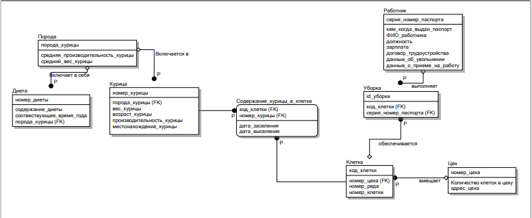

# **Lab 3**

## **Зачем?**

Реализовать вот это по заданию лабораторной работы



## **На чем?**

POSTGRE version `13.1`

## **1.Breed**

| name           | type           | primary key    | unique  | not null | references          |
|:-------------- |:-----------    |:-------------- |:--------|:---------|:------------------- |
| breed_id       | `int`          | `true`         |`true`   | `true`   | `null`              |
| average_kpd    | `int`          |`false`         |`false`  | `false`  | `null`              |
| average_weight | `int`          |`false`         | `false` | `false`  | `null`              |

### **Creation**

```
create table breed(
	breed_id int primary key, 
	average_kpd int, 
	average_weight int
);
```

### **Commands**

```
insert into breed values (
	1,
	2,
	3
);
```

## **2.Diet**

| name           | type           | primary key    | unique  | not null | references          |
|:-------------- |:-----------    |:-------------- |:--------|:---------|:------------------- |
| diet_id        | `int`          | `true`         |`true`   | `true`   | `null`              |
| content        | `varchar(40)`  | `false`        |`false`  | `false`  | `null`              |
| season         | `varchar(40)`  | `false`        |`false`  | `false`  | `null`              |
| breed          | `int`          | `false`        |`false`  | `false`  | `Breed.breed_id`    |

### **Creation**

```
create table diet (
	diet_id int primary key, 
	content varchar(40), 
	season varchar(40), 
	breed int, 
	foreign key (breed) references breed (breed_id)
);
```

### **Commands**

```
insert into diet values (
	1, 
	"2", 
	"3", 
	1
);
```

## **3.Chicken**

| name           | type           | primary key    | unique  | not null | references          |
|:-------------- |:-----------    |:-------------- |:--------|:---------|:------------------- |
| chicken_id     | `int`          | `true`         |`true`   | `true`   | `null`              |
| weight         | `int`          | `false`        |`false`  | `false`  | `null`              |
| age            | `int`          | `false`        |`false`  | `false`  | `null`              |
| kpd            | `int`          | `false`        |`false`  | `false`  | `null`              |
| place          | `varchar(40)`  | `false`        |`false`  | `false`  | `null`              |
| breed          | `int`          | `false`        |`false`  | `false`  | `Breed.breed_id`    |

### **Creation**

```
create table chicken (
	chicken_id int primary key, 
	weight int, 
	age int, 
	kpd int, 
	place varchar(40), 
	breed int, 
	foreign key (breed) references breed (breed_id)
);
```

### **Commands**

```
insert into diet values (
	1, 
	100, 
	10, 
	50, 
	"here", 
	1
);
```

## **4.Worker**

| name           | type           | primary key    | unique  | not null | references          |
|:-------------- |:-----------    |:-------------- |:--------|:---------|:------------------- |
| worker_id      | `int`          | `true`         |`true`   | `true`   | `null`              |
| passport       | `varchar(40)`  | `false`        |`false`  | `false`  | `null`              |
| passport_timing| `varchar(40)`  | `false`        |`false`  | `false`  | `null`              |
| fio            | `varchar(80)`  | `false`        |`false`  | `false`  | `null`              |
| work_place     | `varchar(40)`  | `false`        |`false`  | `false`  | `null`              |
| salary         | `int`          | `false`        |`false`  | `false`  | `null`              |
| doc            | `int`          | `false`        |`false`  | `false`  | `null`              |
| fire           | `boolean`      | `false`        |`false`  | `false`  | `null`              |
| hire           | `date`         | `false`        |`false`  | `false`  | `null`              |

### **Creation**

```
create table worker (
	worker_id int primary key,
	passport varchar(40), 
	passport_timing varchar(40), 
	fio varchar(80), 
	work_place varchar(40), 
	salary int, 
	doc int, 
	fire boolean, 
	hire date
);
```

### **Commands**

```
insert into diet values (
	1, 
	"133333", 
	"12.02.2020", 
	"Antonov Anton Antonovich", 
	"here", 
	15000, 
	123, 
	false, 
	"12.03.2019"
);
```

## **5.Department**

| name           | type           | primary key    | unique  | not null | references          |
|:-------------- |:-----------    |:-------------- |:--------|:---------|:------------------- |
| department_id  | `int`          | `true`         |`true`   | `true`   | `null`              |
| capacity       | `int`          | `false`        |`false`  | `false`  | `null`              |
| address        | `varchar(40)`  | `false`        |`false`  | `false`  | `null`              |

### **Creation**

```
create table department (
	department_id int primary key, 
	capacity int, 
	address varchar(40)
);
```

### **Commands**

```
insert into diet values (
	1, 
	100, 
	"Pushkin's st."
);
```

## **6.Cell**

| name           | type           | primary key    | unique  | not null | references                 |
|:-------------- |:-----------    |:-------------- |:--------|:---------|:-------------------        |
| cell_id        | `int`          | `true`         |`true`   | `true`   | `null`                     |
| row            | `int`          | `false`        |`false`  | `false`  | `null`                     |
| cell           | `int`          | `false`        |`false`  | `false`  | `null`                     |
| department     | `int`          | `false`        |`false`  | `false`  | `Department.department_id` |

### **Creation**

```
create teble cell (
	cell_id int primary key, 
	row int, 
	cell int, 
	department int, 
	foreign key (department) references department (department_id)
);
```

### **Commands**

```
insert into diet values (
	1, 
	2, 
	3, 
	1
);
```

## **7.Cleaning**

| name           | type           | primary key    | unique  | not null | references                 |
|:-------------- |:-----------    |:-------------- |:--------|:---------|:-------------------        |
| cleaning_id    | `int`          | `true`         |`true`   | `true`   | `null`                     |
| cell           | `int`          | `false`        |`false`  | `false`  | `Cell.cell_id`             |
| worker         | `int`          | `false`        |`false`  | `false`  | `Worker.worker_id`         |

### **Creation**

```
create table cleaning (
	cleaning_id int primary key, 
	cell int, 
	worker int, 
	foreign key (cell) references cell (cell_id), 
	foreign key (worker) references worker (worker_id)
);
```

### **Commands**

```
insert into diet values (
	1, 
	1, 
	1, 
	1
);
```

## **8.Maintenance**

| name           | type           | primary key    | unique  | not null | references                 |
|:-------------- |:-----------    |:-------------- |:--------|:---------|:-------------------        |
| maintenance_id | `int`          | `true`         |`true`   | `true`   | `null`                     |
| in_d           | `date`         | `false`        |`false`  | `false`  | `null`                     |
| out_d          | `date`         | `false`        |`false`  | `false`  | `null`                     |
| cell           | `int`          | `false`        |`false`  | `false`  | `Cell.cell_id`             |
| chicken        | `int`          | `false`        |`false`  | `false`  | `Chicken.chicken_id`       |

### **Creation**

```
create table maintenance (
	maintenance_id int primary key, 
	in_d date, 
	out_d date, 
	cell int, 
	chicken int, 
	foreign key (cell) references cell (cell_id), 
	foreign key (chicken) references chicken (chicken_id)
);
```

### **Commands**

```
insert into diet values (
	1, 
	"20.03.2018", 
	"23.04.2018", 
	1, 
	1
);
```


# Requests
# Result: 31


## Request 1

Вывести всю информацию из таблиц chicken и breed совместно.
```
select * from chicken, breed order by chicken;
```
## Result

 chicken_id | weight | age | kpd | place | breed | breed_id | average_kpd | average_weight
------------|--------|-----|-----|-------|-------|----------|-------------|----------------
          1 |    100 |  10 |  30 | Here  |     1 |        2 |           2 |              3
          1 |    100 |  10 |  30 | Here  |     1 |        1 |           2 |              3
          1 |    100 |  10 |  30 | Here  |     1 |        3 |           3 |              2
          2 |     10 | 100 |  60 | Here  |     2 |        2 |           2 |              3
          2 |     10 | 100 |  60 | Here  |     2 |        1 |           2 |              3
          2 |     10 | 100 |  60 | Here  |     2 |        3 |           3 |              2
          3 |    200 |  50 |  50 | Here  |     3 |        1 |           2 |              3
          3 |    200 |  50 |  50 | Here  |     3 |        3 |           3 |              2
          3 |    200 |  50 |  50 | Here  |     3 |        2 |           2 |              3


### score += 1 (1)

## Request 2

Вывести информацию о содержании курицы с id = 1 
```
select * from maintenance, chicken where chicken = 1 and chicken_id = 1;
```
## Result

 maintenance_id |    in_d    |   out_d    | cell | chicken | chicken_id | weight | age | kpd | place | breed
----------------|------------|------------|------|---------|------------|--------|-----|-----|-------|-------
              1 | 2018-03-20 | 2018-04-23 |    1 |       1 |          1 |    100 |  10 |  30 | Here  |     1
              
### score += 1 (2)

## Request 3

Вывести информацию о содержании курицы с id = 1 и датой заселения в марте
```
select * from maintenance where (select extract(month from in_d) = 3) and chicken = 1;
```
## Result

 maintenance_id |    in_d    |   out_d    | cell | chicken
----------------|------------|------------|------|---------
              1 | 2018-03-20 | 2018-04-23 |    1 |       1
              
### score += 2 (4)

## Request 4

Вывести информацию о id и местонахождении курицы
```
select concat(chicken_id, ' - ', place) as id_place from chicken;
```
## Result

 id_place
----------
 1 - Here
 2 - Here
 3 - Here
              
### score += 2 (6)

## Request 5

Вывести информацию о породе курицы с id 2
```
 select * from breed where breed_id in (select breed from chicken where chicken_id = 2);
```
## Result

 breed_id | average_kpd | average_weight
----------|-------------|----------------
        2 |           2 |              3
              
### score += 2 (8)

## Request 6

Вывести информацию о породе курицы с расположением в клетке 1
```
 select * from breed where breed_id in (select breed from chicken where chicken_id in (select chicken from maintenance where cell = 1));
```
## Result

breed_id  | average_kpd | average_weight
----------|-------------|----------------
        1 |           2 |              3
              
### score += 2 (10)

## Request 7

Вывести информацию о весе куриц с породой 1 и примерном весе куриц с породой 1
```
 select sum(weight) as current, sum(average_weight) as target from chicken, breed where breed_id = 1;
```
## Result

 current | target
---------|--------
     310 |      9
              
### score += 2 (12)

 ## Request 8

Вывести информацию о весе куриц, которые весят меньше 150
```
 select chicken_id, sum(weight) as current from chicken group by chicken_id having sum(weight) < 150 order by chicken_id;
```
## Result

 chicken_id | current
------------|---------
          1 |     100
          2 |      10
              
### score += 2 (14)

 ## Request 9

Вывести информацию курицах, размещенных в клетках
```
select distinct * from chicken where exists (select chicken from maintenance);
```
## Result

 chicken_id | weight | age | kpd | place | breed
------------|--------|-----|-----|-------|-------
          1 |    100 |  10 |  30 | Here  |     1
          3 |    200 |  50 |  50 | Here  |     3
          2 |     10 | 100 |  60 | Here  |     2
              
### score += 2 (16)

  ## Request 10

Вывести информацию о курицах, обгоняющих породу по весу
```
select chicken_id, weight from chicken where weight > all (select average_weight from breed);
```
## Result

 chicken_id | weight
------------|--------
          1 |    100
          2 |     10
          3 |    200
              
### score += 2 (18)

  ## Request 11

Вывести информацию о курицах, которых не заселили
```
select distinct * from chicken where not chicken_id = some (select chicken from maintenance);
```
## Result

 chicken_id | weight | age | kpd | place | breed
------------|--------|-----|-----|-------|-------
              
### score += 2 (20)

  ## Request 12

Вывести информацию о диете для породы 3 и времени года - Весны
```
select * from diet where breed = 3 intersect select * from diet where season = 'Spring';
```
## Result

 diet_id | content | season | breed
---------|---------|--------|-------
       1 | Cool    | Spring |     3
              
### score += 2 (22)

  ## Request 13

Вывести информацию о диете для породы 3 и времени года - не Лета
```
select * from diet where breed = 3 except select * from diet where season = 'Summer';
```
## Result

 diet_id | content | season | breed
---------|---------|--------|-------
       1 | Cool    | Spring |     3
              
### score += 2 (24)

  ## Request 14

Вывести объединенную информацию о работнике и уборке
```
select worker_id from worker union all select cell from cleaning;
```
## Result

 worker_id
-----------
         1
         2
         3
         1
         2
         3
              
### score += 2 (26)

  ## Request 15

Вывести объединенную информацию о диете и породе
```
select * from breed left join diet on diet.breed = breed_id;
```
## Result

 breed_id | average_kpd | average_weight | diet_id | content | season | breed
----------|-------------|----------------|---------|---------|--------|-------
        3 |           3 |              2 |       1 | Cool    | Spring |     3
        2 |           2 |              3 |       2 | Cooler  | Spring |     2
        3 |           3 |              2 |       3 | Best    | Summer |     3
        1 |           2 |              3 |         |         |        |
              
### score += 2 (28)

  ## Request 16

Вывести объединенную информацию о диете, породе и курице
```
select * from chicken left join breed on chicken.breed = breed_id left join diet on diet.breed = breed_id order by chicken;
```
## Result

 chicken_id | weight | age | kpd | place | breed | breed_id | average_kpd | average_weight | diet_id | content | season | breed
------------|--------|-----|-----|-------|-------|----------|-------------|----------------|---------|---------|--------|-------
          1 |    100 |  10 |  30 | Here  |     1 |        1 |           2 |              3 |         |         |        |
          2 |     10 | 100 |  60 | Here  |     2 |        2 |           2 |              3 |       2 | Cooler  | Spring |     2
          3 |    200 |  50 |  50 | Here  |     3 |        3 |           3 |              2 |       1 | Cool    | Spring |     3
          3 |    200 |  50 |  50 | Here  |     3 |        3 |           3 |              2 |       3 | Best    | Summer |     3
              
### score += 2 (30)

  ## Request 17 (полировочный)

Вывести вообще все
```
select * from diet, breed, chicken, maintenance, cell, worker, cleaning, department;
```
## Result

 diet_id | content | season | breed | breed_id | average_kpd | average_weight | chicken_id | weight | age | kpd | place | breed | maintenance_id |    in_d    |   out_d    | cell | chicken | cell_id | row | cell | department | worker_id | passport | passport_timing |           fio            | work_place | salary | doc | fire |    hire    | cleaning_id | cell | worker | department_id | capacity |   address
---------|---------|--------|-------|----------|-------------|----------------|------------|--------|-----|-----|-------|-------|----------------|------------|------------|------|---------|---------|-----|------|------------|-----------|----------|-----------------|--------------------------|------------|--------|-----|------|------------|-------------|------|--------|---------------|----------|-------------
Бесконечность........
              
### score += 1 (31)