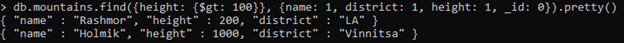
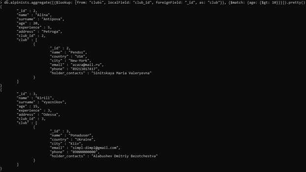
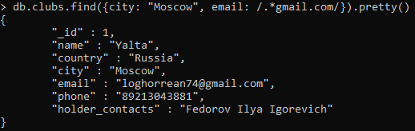

# MongoDB

## Модель


## Создание и заполнение

```
db.mountains.insertOne({_id: 1, name: "Ural", height: 100, district: "Frunzenskiy", country: "Russia"})
db.mountains.insertOne({_id: 2, name: "Rashmor", height: 200, district: "LA", country: "USA"})
db.mountains.insertOne({_id: 3, name: "Holmik", height: 1000, district: "Vinnitsa", country: "Ukraine"})
```
```
db.clubs.insertOne({_id: 1, name: "Yalta", country: "Russia", city: "Moscow", email: "loghorrean74@gmail.com", phone: "89213043881", holder_contacts: "Fedorov Ilya Igorevich"})
db.clubs.insertOne({_id: 2, name: "Pendos", country: "USA", city: "New-York", email: "azaza@mail.ru", phone: "89213817417", holder_contacts: "Sinitskaya Maria Valeryevna"})
db.clubs.insertOne({_id: 3, name: "Ponaduser", country: "Ukraine", city: "Kiiv", email: "simpl-dimpl@gmail.com", phone: "89000000000", holder_contacts: "Alabushev Dmitriy Bezotchestva"})
```
```
db.alpinists.insertOne({_id: 1, name: "German", surname: "Ishakov", age: 10, experience: 1, address: "Nikolskoye", club_id: 1})
db.alpinists.insertOne({_id: 2, name: "Alina", surname: "Antipova", age: 20, experience: 5, address: "Petroga", club_id: 2})
db.alpinists.insertOne({_id: 3, name: "Kirill", surname: "Vyaznikov", age: 15, experience: 3, address: "Odessa", club_id: 3})
```
```
db.groupings.insertOne({_id: 1, name: "Group 1", created_at: new Date("2021-05-27"), alpinists: [1, 2, 3], ascendings: [{mountain_id: 1, points: [{name: "Name 1", description: "Description 1"}], started_at: new Date("2021-05-27"), ended_at: new Date("2021-05-27"), is_finished: true, emergencies: []}]})
db.groupings.insertOne({_id: 2, name: "Group 2", created_at: new Date("2021-05-27"), alpinists: [2], ascendings: [{mountain_id: 2, points: [{name: "Name 2", description: "Description 2"}], started_at: new Date("2021-05-27"), ended_at: new Date("2021-05-27"), is_finished: true, emergencies: []}]})
db.groupings.insertOne({_id: 3, name: "Group 3", created_at: new Date("2021-05-27"), alpinists: [3], ascendings: [{mountain_id: 3, points: [{name: "Name 3", description: "Description 3"}], started_at: new Date("2021-05-27"), ended_at: new Date("2021-05-27"), is_finished: true, emergencies: [{alpinist_id: 3, description: "Injure"}]}]})
```
## Запрос 1
```
Вывести название и высоту гору и название района для гор выше 100 метров
```
```
db.mountains.find({height: {$gt: 100}}, {name: 1, height: 1, district: 1, _id: 0}).pretty()
```

## Запрос 2
```
Вывести названия и высоту гор в районах, имеющих в названии букву i
```
```
db.mountains.find({"name": /.*i.*/}, {name: 1, height: 1}).pretty()
```

## Запрос 3
```
Вывести информацию об альпинистах, старше 10 лет
```
```
db.alpinists.aggregate([{$lookUp: {from: "clubs", localField: "club_id", foreignField: "_id", as: "club"}}, {$match: {age: {$gt: 10}}}]).pretty()
```

## Запрос 4
```
Вывести информацию о клубах, находящихся в Москве и с контактным почтовым адресом кончающимся на ‘gmail.com’
```
```
db.clubs.find({city: "Moscow", email: /.*gmail.com/}).pretty()
```
