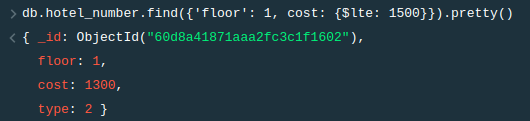
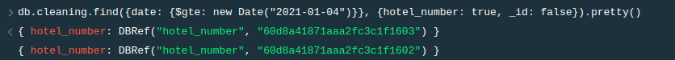
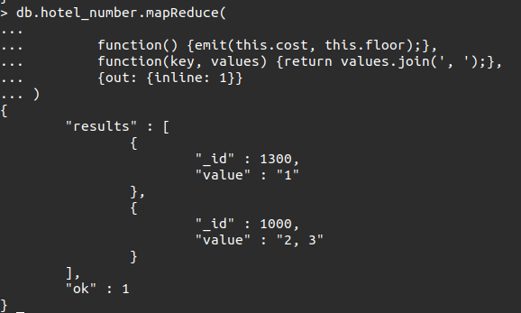

## Запрос 1
Найти номера дешевле 1000, находящиеся на 1 этаже
```
db.hotel_number.find({'floor': 1, cost: {$lte: 1500}}).pretty()
```



## Запрос 2
Найти номера, в которых уборка проводиться после выбранной даты.
```
db.cleaning.find({date: {$gte: new Date("2021-01-04")}}, {hotel_number: 1}).pretty()
```


## Запрос 3
Узнать дату заселения в определенный номер.
```
var number = db.hotel_number.findOne({floor: 3})._id
db.chek_in.find({hotel_number: new DBRef("hotel_number", number)}, {date: true, _id: false}).pretty()
```


## Запрос 4
Вывести количество клиентов, заселенных в этом году.
```
db.chek_in.find({date: {$gte: new Date("2021-01-01"), $lte: new Date("2021-12-31")}}).count()
```


## Запрос 5
Вывести этажи номеров отелей, сгруппировав по стоимости.
```
db.hotel_number.mapReduce(

        function() {emit(this.cost, this.floor);}, 
        function(key, values) {return values.join(', ');}, 
        {out: {inline: 1}}
)
```



