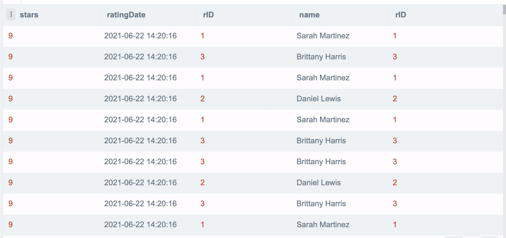
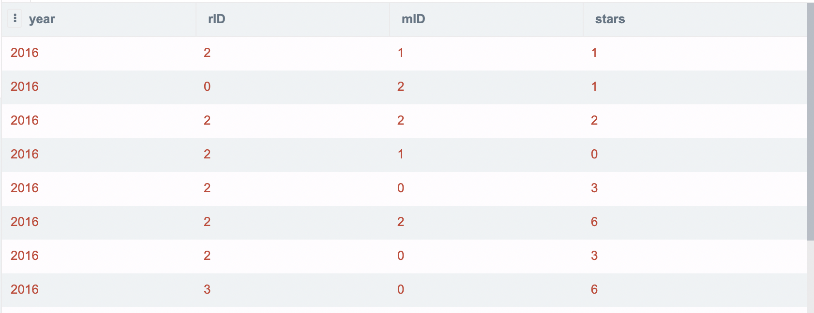
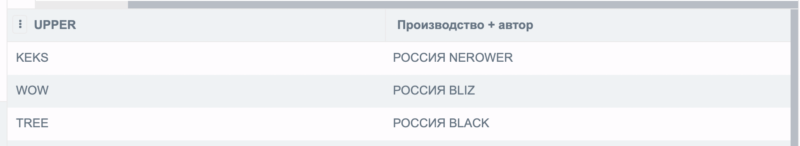
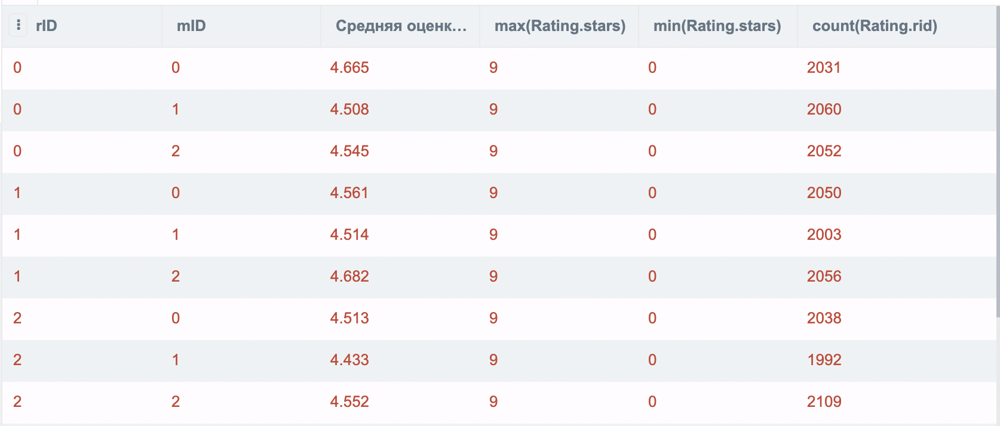

# Запросы к БД

## 1. Выбор значений, заданных атрибутов из более чем двух таблиц с сортировкой

```SQL
select stars, ratingdate, Rating.rid, name, Reviewer.rid
from
 Rating
 join Reviewer on Rating.rid=Reviewer.rid
order by stars DESC;
```



## 2. Запрос с двойным условием
Получение фильмов новее 1900 года с безымянным режиссером

```SQL
SELECT * FROM Movie WHERE year > 1900 AND director ISNULL
```


## 3. Использование функций для работы с датами
Получение отзывов за период между 2015 и 2016 годами


```SQL
SELECT 
    substr(ratingdate, 1, 4) as year,
    rid, 
    mid, 
    stars
FROM Rating 
WHERE year BETWEEN "2015" AND "2016"
```



## 4. Использование строковых функций
Получить все названия фильмов и их авторов в регистронезависимым режиме с фильтрацией где имеется режисер

```SQL
SELECT UPPER(title) AS "UPPER", 'РОССИЯ ' || UPPER(director) AS "Производство + автор" FROM Movie WHERE director NOTNULL;
```



## 5. Запрос с использованием подзапросов
Вывести все оценки пользователей и соответствующие им фильмы

```SQL
SELECT substr(ratingdate, 1, 4) as YEAR, title, director, stars FROM Movie, Rating
WHERE EXISTS (
  SELECT * FROM Rating where Movie.mid=Rating.rid
)
```


## 6. Вычисление групповой (агрегатной) функции
Отобразить по каждому пользователю его максимальный балл оценки, минимальный балл оценки, среднюю оценку среди оставленных им отзывов и количество оставленных отзывов 

```SQL
SELECT 
    Rating.rid,
    Rating.mid,
    round(avg(Rating.stars), 3) as "Средняя оценка фильма",
    max(Rating.stars),
    min(Rating.stars),
    count(Rating.rid)
from Rating
GROUP by Rating.rid, Rating.mid
```



## 7. Вычисление групповой (агрегатной) функции с условием HAVING
Подсчитать количество отзывов на каждый существующий фильм в которых присутствует более 5 оценок от пользователей

```SQL
SELECT
    Movie.title as "Название фильма",
    COUNT(RET.stars) as "Количество отзывов на фильм",
    avg(RET.stars) as "Средняя оценка"
from Movie 
LEFT JOIN 
    Rating RET ON Movie.mid = RET.mid
GROUP BY Movie.title
HAVING COUNT(RET.stars) > 5
```


## 8. Использование предикатов EXISTS, ALL, SOME и ANY
Подсчитать количество отзывов на сайте

```SQL
SELECT 
    COUNT(*)
from Rating, Movie
WHERE EXISTS (
  SELECT stars from Rating where Rating.mid = Movie.mid
)
```


## 9. Использование запросов с операциями реляционной алгебры
Подсчитать общее количество отзывов, среднее значение отзывов с округлением до 2 знаков после запятой, максимальную и минимальную оценку оставленных пользователями 2 и 3 для фильма с индексом 1

```SQL
SELECT COUNT(rid), round(avg(stars), 3), MAX(stars), MIN(stars)
FROM (SELECT * FROM Rating
      INTERSECT
      SELECT * FROM Rating
      WHERE rid IN (2,3)
          AND mid IN (1)
     );
```


## 10. Использование объединений запросов
Получить имя обзорщика, название фильма, количество оставленных отзывов, усредненную оценку по каждому из оцененных пользователей фильмов 

```SQL
SELECT 
    Rating.rid,
    Rating.mid,
    REV.name as "Имя обзорщика",
    MOV.title as "Название фильма",
    round(avg(Rating.stars), 3) as "Среднее значечение оценки",
    count(Rating.rid)
from Rating
INNER JOIN 
    Movie MOV ON MOV.mid = Rating.mid
INNER JOIN 
    Reviewer REV ON REV.rid = Rating.rid
GROUP by Rating.rid, Rating.mid
```

