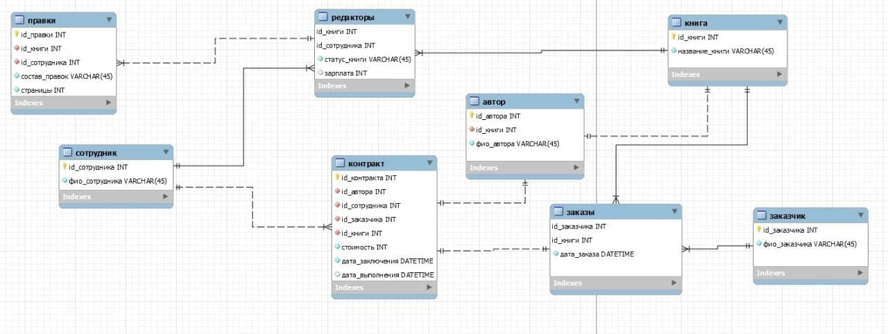

## Модель БД



## Создание и заполнение БД

```
> use BookShop
switched to db BookShop

> db.createCollection("employeers")
{ "ok" : 1 }
> db.createCollection("book")
{ "ok" : 1 }

> db.createCollection("customers")
{ "ok" : 1 }

> db.createCollection("editors")
{ "ok" : 1 }

> db.createCollection("revisions")
{ "ok" : 1 }

> db.createCollection("contract")
{ "ok" : 1 }

> db.createCollection("orders")
{ "ok" : 1 }

> db.employeers.insert({"full_name": "Иванов Дмитрий Александрович"})
WriteResult({ "nInserted" : 1 })
> 
> db.employeers.insert({"full_name": "Борисов Борис Борисович"})
WriteResult({ "nInserted" : 1 })
> 
> db.book.insert({"book_name": "Буратино"})
WriteResult({ "nInserted" : 1 })
> 
> db.book.insert({"book_name": "Всё о SQL"})
WriteResult({ "nInserted" : 1 })
> 
> db.customers.insert({"full_name": "Григорьев Петр Сергеевич"})
WriteResult({ "nInserted" : 1 })
> 
> db.editors.insert({"_id": ObjectId("60d760b2afd1ef3a3d5036ec"), "book_id": ObjectId("60d76104afd1ef3a3d5036ed"), "book_status": "редактирование", "salary": 1337})
WriteResult({ "nInserted" : 1 })
> 
> db.revisions.insert({"book_id": ObjectId("60d76104afd1ef3a3d5036ed"), "employee_id": ObjectId("60d760b2afd1ef3a3d5036ec"), "composition": "переработка содержания", "pages": 2})
WriteResult({ "nInserted" : 1 })
> 
> db.contract.insert({"author_id": ObjectId("60d760b2afd1ef3a3d5036ec"), "employee_id": ObjectId("60d760b2afd1ef3a3d5036ec"), "book_id": ObjectId("60d76104afd1ef3a3d5036ed"), "amount": 1500, "conclusion": ISODate("2020-09-10T16:16:42.301Z"), "completion": ISODate("2020-19-12T16:16:42.301Z")})
WriteResult({ "nInserted" : 1 })
> 
> db.orders.insert({"customer_id": ObjectId("60d76160afd1ef3a3d5036ee"), "book_id": ObjectId("60d76104afd1ef3a3d5036ed"), "order_date": ISODate("2020-07-10T16:16:42.301Z")})
WriteResult({ "nInserted" : 1 })
> 
```

## Запросы к БД MongoDB

#### 1) Вывести список всех книг
```
db.book.find({},{_id: 0, book_name: 1});
```
#### 2) Вывести список заказов для каждого заказчика
```
db.orders.aggregate( [ { $lookup: { from: "customers", localField: "customerID", foreignField: "customerID", as: "customer"  } }, { $out: "customerCol"} ] )
db.customerCol.find( {}, {_id: 0, orderDate: 1, customer: {customerName: 1}} )
```
#### 3) Вывести даты заказов, стоимость которых меньше 1000
```
db.orders.aggregate( [ { $lookup: { from: "contract", localField: "contractID", foreignField: "contractID", as: "contract" } }, { $out: "contractCol"} ] )
db.contractCol.find({price: {$lt: 1000} }, {_id: 0, product: {date: 1}})
```
#### 4) Вывести список покупателей с именем Петр 
```
db.customers.find({full_name: {$regex:"Петр"}})
```
#### 5) Вывести количество символов ФИО сотрудников
```
db.employeers.aggregate([{ $project: { "full_name": 1, "length"{ $strLenCP: "full_name"} } }])
```