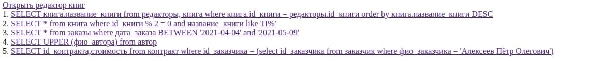
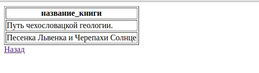
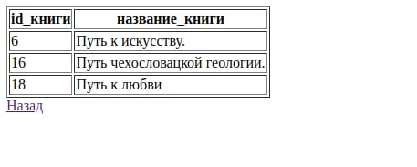
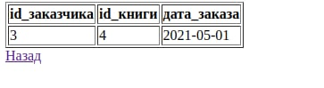
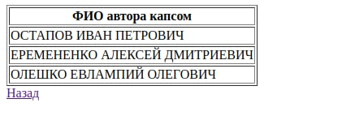
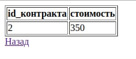
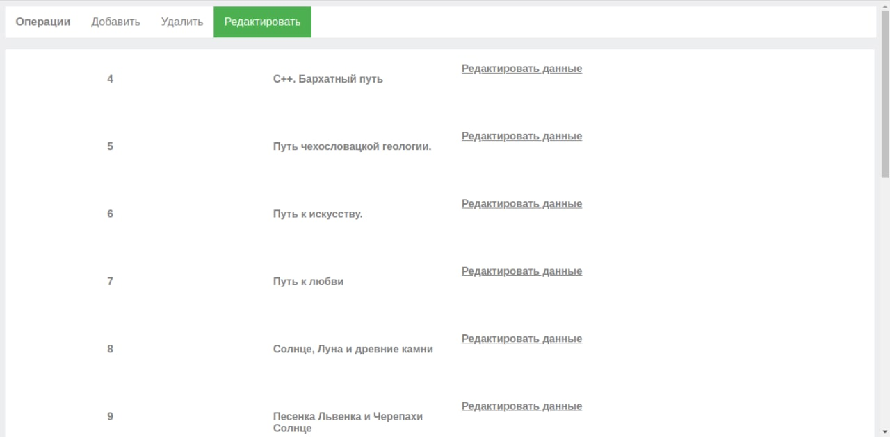
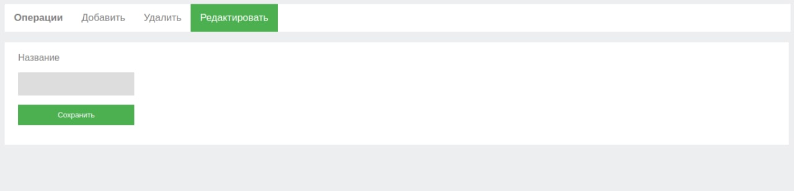
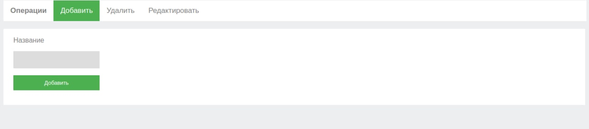
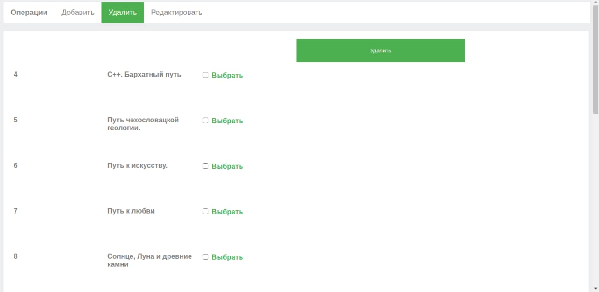

## 1. Главная


Рис 1. Главная страница.

## 2. Запросы

### 2.1
```
SELECT книга.название_книги from редакторы, книга where книга.id_книги = редакторы.id_книги order by книга.название_книги DESC
```


Рис 2. Результат запроса 2.1.

### 2.2
```
SELECT * from книга where id_книги % 2 = 0 and название_книги like 'П%'
```


Рис 3. Результат запроса 2.2.

### 2.3
```
SELECT * from заказы where дата_заказа BETWEEN '2021-04-04' and '2021-05-09'
```


Рис 4. Результат запроса 2.3.

### 2.4
```
SELECT UPPER (фио_автора) from автор
```


Рис 5. Результат запроса 2.4.

### 2.5
```
SELECT id_контракта,стоимость from контракт where id_заказчика = (select id_заказчика from заказчик where фио_заказчика = 'Алексеев Пётр Олегович')
```


Рис 6. Результат запроса 2.5.

## 3. Интерфейсы

### 3.1

Рис 7. Интерфейс списка книг.

### 3.2

Рис 8. Редактирование книги.

### 3.3

Рис 9. Добавление книги.

### 3.4

Рис 9. Удаление книги.