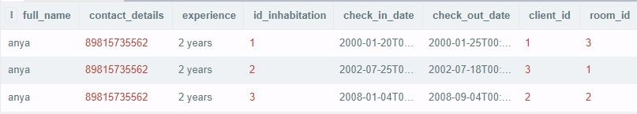
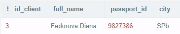
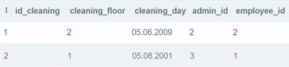
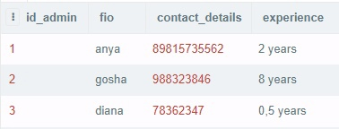
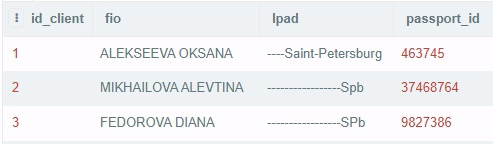
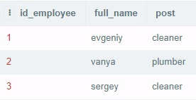
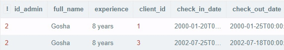
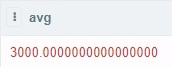
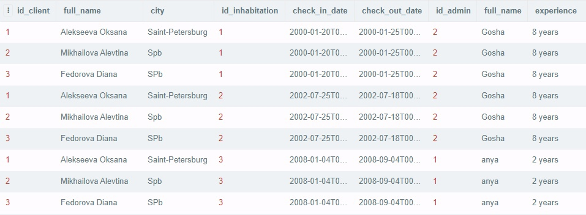
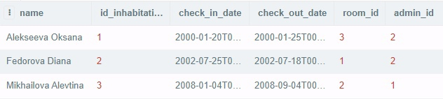

# Запросы

###№1 
####Выбор администраторов, у которых опыт работы 2 года, с сортировкой по дате заезда. 
```
SELECT full_name, contact_details, experience, id_inhabitation, check_in_date, check_out_date, client_id, room_id 
        FROM administration, inhabitation WHERE experience = '2 years' ORDER BY check_in_date;
```

###№2
####Выбор пользователей, которые живут в городе 'SPb' и их номер > 2.
```
SELECT * FROM client WERE city = 'SPb' AND id_client > 2;
```

###№3 + многострочный подзапрос
####Выбор детелей проведения уборок, которые были выполнены в один и тот же по счету день месяца.
```
SELECT * FROM cleaning WHERE DAYOFMONTH(SELECT cleaning_day from cleaning WHERE cleaning_day = '05.06.2009') = 
        DAYOFMONTH(SELECT cleaning_day from cleaning WHERE cleaning_day = '05.08.2001');
```

###№4.1
####Выбор администраторов с использованием функции смены регистра.
```
SELECT id_admin, LOWER(full_name) AS FIO, contact_details, experience FROM administration;
```

###№4.2
####Выбор клиентов с использованием функции смены регистра и добавления указанных символов до определенной длины.
```
SELECT id_client, UPPER(full_name) AS FIO, LPAD (city, 20, '-'), passport_id FROM client;
```

###№5.1
####Выбор сотрудников, с которыми был заключен контракт.
```
SELECT id_employee, full_name, post FROM employee where id_employee IN (SELECT employee_id FROM employment_contract);
```
 
###№5.2 + подзапросы + использование предикатов
####Выбор администраторов со стажем работы 8 лет, которые регистрировали проживания клиентов
```
SELECT id_admin, full_name, experience, client_id, check_in_date, check_out_date FROM administration RIGHT JOIN
        inhabitation ON admin_id = id_admin WHERE experience = '8 years' 
               AND full_name = SOME(SELECT full_name FROM inhabitation);
```

###№6
####Вывод средней стоимости по проживанию на 1 этаже.
```
SELECT AVG(coat_of_living) FROM room WHERE floor=1;
```

###№7.1
####Выбор максимальной стоимости проживания типа 'lux' c сортировкой по номеру.
```
SELECT MAX(coat_of_living) AS Max_cost_of_living FROM room GROUP BY id_room HAVING room_type in ('lux');
```

###№7.2
####Выбор комнат(номеров), у которых сумма проживания > 10000 с сортировкой по номеру.
```
SELECT * FROM room GROUP BY id_room HAVING SUM (coat_of_living)> 10000;
```

###№8
####Выбор клиента без повторений, у которого город 'SPb' и любое ФИО.
```
SELECT DISTINCT id_client, full_name, passport_id FROM client
        WHERE city = 'SPb' AND full_name = ALL(SELECT full_name FROM inhabitation);
```

###№9
####Выбор клиентов и администраторов, которые оформляли им проживание(пересечение).
```
SELECT id_client, client.full_name, city, id_inhabitation, check_in_date, check_out_date, id_admin, 
        administration.full_name, experience from client, inhabitation, administration WHERE admin_id = id_admin;
```

###№10.1
####Выбор клиентов и объединение с проживанием.
```
SELECT full_name AS name, id_inhabitation, check_in_date, check_out_date, room_id, admin_id 
        FROM inhabitation INNER JOIN client ON id_client = client_id;
```

###№10.2
####Выбор клиентов и объединение с проживанием(исключение).
```
SELECT full_name AS name, id_inhabitation, check_in_date, check_out_date, room_id, admin_id 
        FROM inhabitation LEFT JOIN client ON id_client = client_id;
```

