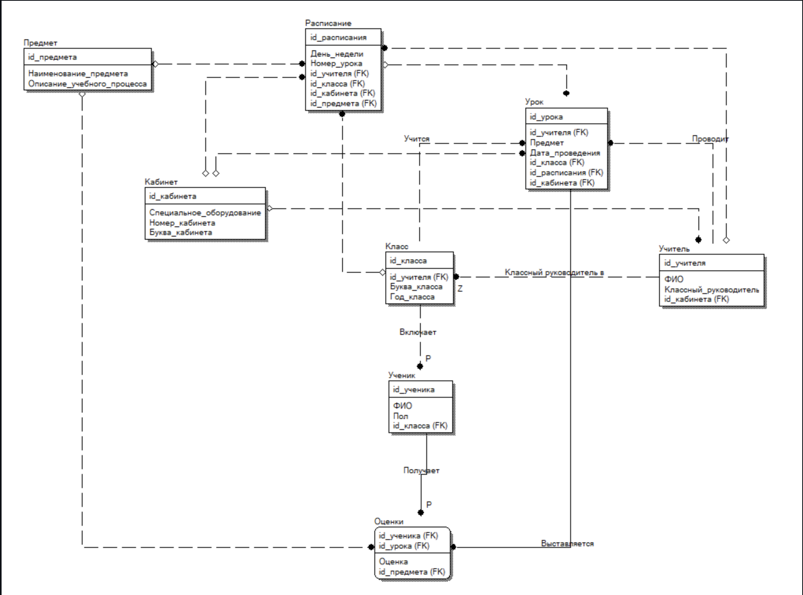

# База данных Школьное расписание

## Описание
База данных, предназначеная для завуча школы.
 
Завуч имеет возможность добавить сведения о новом учителе или ученике, вносить в базу данных четвертные оценки учеников каждого класса по каждому предмету, удалять данные об уволившемся учителе и отчисленном из школы ученике, вносить изменения в данные об учителях и учениках, в том числе поменять оценку ученика по тому или иному предмету. В задачу завуча входит также составление расписания.

## Модель данных


##class
Классы, например 9Б, 6А

| Поле|Тип данных   | Первичный ключ  | Внешний ключ  | NULLABLE |Описание  |
|---|---|---|---|---|---|
| id  | INT  | &#9745;  |   | |Уникальный идентификатор  |
| id_teacher | INT  |   |&#9745;|   | Классный руководитель |
|   letter| VARCHAR(1)  |   |   |   | Буква класса|
|year|INT||||Год класса|

##marks
Оценки учеников. Внешние ключи: ученик, урок, предмет

| Поле       | Тип данных | Первичный ключ | Внешний ключ | NULLABLE | Описание                          |
|------------|------------|----------------|--------------|----------|-----------------------------------|
| id_pupil   | INT        | &#9745;        | &#9745;      |          | Ученик, получивший оценку         |
| id_lesson  | INT        | &#9745;        | &#9745;      |          | Урок, на котором поставили оценку |
| mark       | INT        |                |              |          | Оценка                            |
| id_subject | INT        |                | &#9745;      |          | Предмет                           |

##pupil
Ученик. Внешний ключ: класс

| Поле     | Тип данных             | Первичный ключ | Внешний ключ | NULLABLE | Описание                           |
|----------|------------------------|----------------|--------------|----------|------------------------------------|
| id       | INT                    | &#9745;        |              |          | Уникальный идентификатор           |
| name     | VARCHAR(45)            |                |              |          | ФИО                                |
| gender   | ENUM("Male", "Female") |                |              |          | Пол                                |
| id_class | INT                    |                | &#9745;      |          | Класс, которому принадлежит ученик |

##room
Кабинет. Имеет номер и букву.

| Поле      | Тип данных  | Первичный ключ | Внешний ключ | NULLABLE | Описание                 |
|-----------|-------------|----------------|--------------|----------|--------------------------|
| id        | INT         | &#9745;        |              |          | Уникальный идентификатор |
| equipment | VARCHAR(45) |                |              | &#9745;  | Оборудование класса      |
| number    | VARCHAR(4)  |                |              |          | Номер кабинета           |
| letter    | VARCHAR(1)  |                |              |          |                    Буква кабинет      |

##subject
Предмет. Имеет название и описание.

| Поле        | Тип данных   | Первичный ключ | Внешний ключ | NULLABLE | Описание                        |
|-------------|--------------|----------------|--------------|----------|---------------------------------|
| id          | INT          | &#9745;        |              |          | Уникальный идентификатор        |
| name        | VARCHAR(45)  |                |              |          | Название предмета               |
| description | VARCHAR(100) |                |              |          | Описание предмета. Учебный план |

##teacher
Учитель. id_classroom_teacher - 1, если учитель – классный руководитель. 0 – если нет.
Имеет внешний ключ на привязанный к нему кабинет. Может быть NULL.

| Поле                 | Тип данных  | Первичный ключ | Внешний ключ | NULLABLE | Описание                                                     |
|----------------------|-------------|----------------|--------------|----------|--------------------------------------------------------------|
| id                   | INT         | &#9745;        |              |          | Уникальный идентификатор                                     |
| name                 | VARCHAR(45) |                |              |          | ФИО                                                          |
| is_classroom_teacher | INT         |                |              |          | 1 – если классный руководитель. 0 – не классный руководитель |
| id_room              | INT         |                | &#9745;      | &#9745;  | Кабинет, к которому привязан учитель                         |
 
##timetable
Расписание урока. Имеет день недели, номер урока. 
Внешние ключи – учитель, кабинет, класс, предмет.

| Поле          | Тип данных                                                                        | Первичный ключ | Внешний ключ | NULLABLE | Описание                              |
|---------------|-----------------------------------------------------------------------------------|----------------|--------------|----------|---------------------------------------|
| id            | INT                                                                               | &#9745;        |              |          | Уникальный идентификатор              |
| day_of_week   | ENUM("Monday, "Tuesday", "Wednesday", "Thursday", "Friday", "Saturday", "Sunday") |                |              |          | День недели                           |
| lesson_number | INT                                                                               |                |              |          | Номер урока. Например 1, 2            |
| id_teacher    | INT                                                                               |                | &#9745;      |          | Учитель, проводящий урок              |
| id_class      | INT                                                                               |                | &#9745;      |          | Класс, который обучается              |
| id_room       | INT                                                                               |                | &#9745;      |          | Кабинет, в котором проводится занятие |
| id_subject    | INT                                                                               |                | &#9745;      |          | Предмет                               |

## Дамп

``` sql
CREATE TYPE public.gender AS ENUM (
     'male',
     'female'
);

CREATE TYPE public.weekday AS ENUM (
    'Monday',
    'Tuesday',
    'Wednesday',
    'Thursday',
    'Friday',
    'Saturday',
    'Sunday'
);

CREATE TABLE public.class (
    id integer NOT NULL,
    id_teacher integer,
    letter character varying(1) NOT NULL,
    year integer NOT NULL
);

CREATE TABLE public.marks (
    id_pupil integer NOT NULL,
    id_lesson integer NOT NULL,
    mark integer,
    id_subject integer,
    CONSTRAINT check_mark CHECK (((mark > 0) AND (mark <= 5)))
);

CREATE TABLE public.pupil (
    id integer NOT NULL,
    name character varying(45) NOT NULL,
    gender public.gender,
    id_class integer
);

CREATE TABLE public.room (
    id integer NOT NULL,
    equipment character varying(45),
    number character varying(4) NOT NULL,
    letter character varying(1) NOT NULL
);

CREATE TABLE public.subject (
    id integer NOT NULL,
    name character varying(45) NOT NULL,
    description character varying(100)
);

CREATE TABLE public.teacher (
    id integer NOT NULL,
    name character varying(45) NOT NULL,
    is_classroom_teacher integer DEFAULT 0 NOT NULL,
    id_room integer
);

CREATE TABLE public.timetable (
    id integer NOT NULL,
    day_of_week public.weekday,
    lesson_number integer NOT NULL,
    id_teacher integer,
    id_class integer,
    id_room integer,
    id_subject integer
);
```

## Запросы

```sql
insert into room values(0, null, 213, 'a');
select equipment from room;
update room set equipment='Принтер' where id = 0;
delete from room where id = 0;
```

## Продвинутые запросы
#### 1
Вывести классы вместе с классными руководителями
```sql
select * from class inner join teacher on teacher.id = class.id_teacher;
```
| id | id_teacher  |  letter | year | id | name           | is_classroom_teacher | id_room |
|----|-------------|---------|------|----|----------------|----------------------|---------|
| 1  | 1           | А       |  9   |  1 |"Мария Ивановна"|         1            |  215    |

#### 2
Вывести всех мальчиков в классе с id = 1
```sql
select * from pupil where pupil.gender = 'male' and id_class = 1;
```
| id | name      | gender | id_class |
|----|-----------|--------|----------|
| 1  | Михаил    | male   | 1        |
| 2  | Валерий   | male   | 1        |
| 3  | Александр | male   | 1        |

#### 3
Вывести год и маленькую букву всех классов
```sql
select year, lower(letter) as letter from class;
```
| year | letter |
|------|--------|
| 9    | A      |

#### 4
Вывести предметы, которые ведет учитель с id = 0
```sql
select distinct name from subject where id = (select id_subject from timetable where id_teacher = 0); 
```
| name       |
|------------|
| Математика |
| Алгебра    |
| Геометрия  |

#### 5
Вывести количество учитилей, работающих в школе
```sql
select count(*) from teacher;
```
| count |
|-------|
| 10    |

#### 6
Вывести средний бал студентов, у которых он ниже 4,5
```sql
select id_pupil, avg(mark) from marks group by id_pupil having avg(mark) < 4.5;
```
| id_pupil | avg  |
|----------|------|
| 2        | 4.47 |
| 3        | 4.49 |

#### 7
Вывести учителей, которые являются классными руководителями
```sql
select * from teacher where exists(select 1 from class where id_teacher = id);
```
| id | name                    | is_classroom_teacher | id_room |
|----|-------------------------|----------------------|---------|
| 1  | Марья Ивановна          | 1                    | 215     |
| 3  | Валентина Александровна | 1                    | 101     |

#### 8
Вывести всех мальчиков
```sql
select * from pupil except select * from pupil where gender = 'male';
```
| id | name    | gender | id_class |
|----|---------|--------|----------|
| 1  | Михаил  | male   | 1        |
| 2  | Валерий | male   | 1        |

#### 9
Вывести классы вместе с классными руководителями
```sql
select * from teacher right join class on class.id_teacher = teacher.id;
```
| id | name           | is_classroom_teacher | id_room | id | id_teacher | letter | year |
|----|----------------|----------------------|---------|----|------------|--------|------|
| 1  | Марья Ивановна | 1                    | 1       | 1  | 1          | А      | 9    |

#### 10
Вывести дни недели, по которым каждый учитель преподает каждый предмет
```sql
select day_of_week, subject.name, teacher.name as teacher_name from timetable right join teacher on timetable.id_teacher = teacher.id right join subject on timetable.id_subject = subject.id;
```
| day_of_week | name       | teacher_name   |
|-------------|------------|----------------|
| 1           | Математика | Марья Ивановна |

#### 11
Вывести имена учеников и их оценки
```sql
select name, mark from pupil right join marks on marks.id_pupil = id;
```
| name      | mark |
|-----------|------|
| Михаил    | 5    |
| Михаил    | 4    |
| Александр | 4    |

#### 12
Вывести букву, номер кабинета и предмет, который в нем преподают
```sql
select letter, number, subject.name from room right join timetable on timetable.id_room = room.id right join subject on id_subject = subject.id;
```
| letter | number | name         |
|--------|--------|--------------|
| NULL   | 215    | Математика   |
| NULL   | 101    | Русский язык |

#### 13
Вывести имена учеников, которые имеют хотя бы одну пятерку
```sql
select name from pupil right join marks on id_pupil = pupil.id where mark = ANY(select mark from marks where id_pupil = pupil.id and mark = 5);
```
| name    |
|---------|
| Михаил  |
| Татьяна |

#### 14
Вывести имена учеников, которые имеют только пятерки
```sql
select name from pupil right join marks on id_pupil = pupil.id where mark = ALL(select mark from marks where id_pupil = pupil.id and mark = 5);
```
| name    |
|---------|
| Валерия |
| Татьяна |
