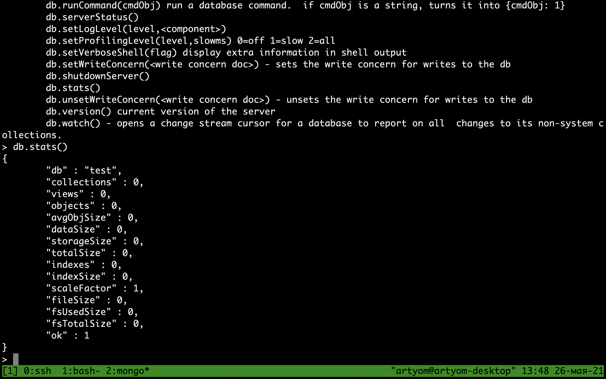
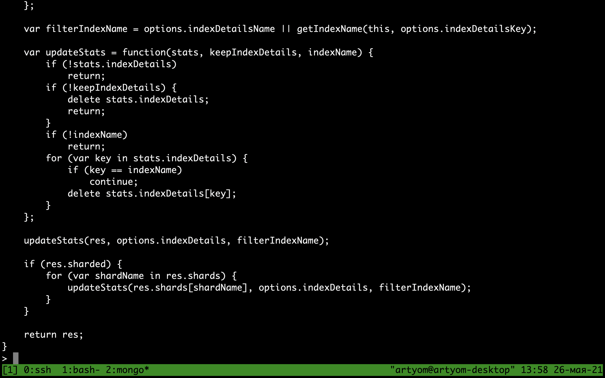
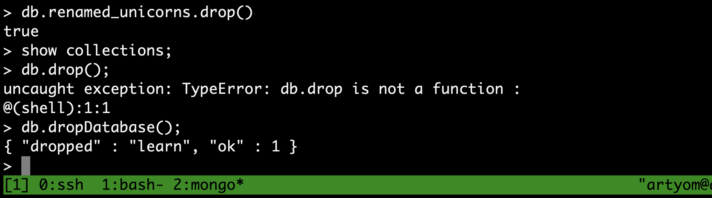

# Лабораторная работа 7. MongoDB

## Практика 1
### 1. Методы db.help(), db.help, db.stats()

db.help()

db.help

db.stats()


### 2. БД learn

Создание бд:


Список баз данных


Вставляем запись


Список всех коллекций


Переименование коллекций


Статистика коллекции


Удаление коллекции и базы данных


## Практика 2

### Учителя

```javascript
> db.teachers.find()
{ "_id" : ObjectId("60d347b92d92972c5189fe11"), "name" : "Valentina", "is_supervisor" : true }

> db.teachers.insertOne({"name": "Maria", "is_supervisor": false})
{
	"acknowledged" : true,
	"insertedId" : ObjectId("60d3488c0b7a2a91dccf4547")
}

> db.teachers.insertOne({"name": "Valeria", "is_supervisor": false})
{
	"acknowledged" : true,
	"insertedId" : ObjectId("60d349d50b7a2a91dccf4548")
}

> db.teachers.insertOne({"name": "Milana", "is_supervisor": false})
{
	"acknowledged" : true,
	"insertedId" : ObjectId("60d349db0b7a2a91dccf4549")
}

```

### Кабинеты

```javascript
> db.rooms.insertOne({"number": "10a", "has_special_equipment": true, "teacher": {"$ref": "teachers", "$id": "60d349db0b7a2a91dccf4549"}})
{
	"acknowledged" : true,
	"insertedId" : ObjectId("60d34b8f0b7a2a91dccf454b")
}

> db.rooms.insertOne({"number": "10b", "has_special_equipment": true})
{
	"acknowledged" : true,
	"insertedId" : ObjectId("60d34ba50b7a2a91dccf454c")
}

> db.rooms.insertOne({"number": "12", "has_special_equipment": false})
{
	"acknowledged" : true,
	"insertedId" : ObjectId("60d34bac0b7a2a91dccf454d")
}

```

### Классы

```javascript

> db.classes.insertOne({"letter": "A", "year": 5, "teacher": {"$ref": "teachers", "$id": "60d349db0b7a2a91dccf4549"}})
{
	"acknowledged" : true,
	"insertedId" : ObjectId("60d34cd730c46204e05dac8b")
}

> db.classes.insertOne({"letter": "Б", "year": 9, "teacher": {"$ref": "teachers", "$id": "60d347b92d92972c5189fe11"}})
{
	"acknowledged" : true,
	"insertedId" : ObjectId("60d34cf330c46204e05dac8c")
}

> db.classes.insertOne({"letter": "В", "year": 8, "teacher": {"$ref": "teachers", "$id": "60d347b92d92972c5189fe11"}})
{
	"acknowledged" : true,
	"insertedId" : ObjectId("60d34cfe30c46204e05dac8d")
}

> db.classes.insertOne({"letter": "А", "year": 1, "teacher": {"$ref": "teachers", "$id": "60d347b92d92972c5189fe11"}})
{
	"acknowledged" : true,
	"insertedId" : ObjectId("60d34d0630c46204e05dac8e")
}

> db.classes.insertOne({"letter": "Д", "year": 3, "teacher": {"$ref": "teachers", "$id": "60d347b92d92972c5189fe11"}})
{
	"acknowledged" : true,
	"insertedId" : ObjectId("60d34d0d30c46204e05dac8f")
}

```

### Предметы

```javascript
> db.subjects.insertOne({"name": "mathematics", "description": "Математика - царица всех наук"})
{
	"acknowledged" : true,
	"insertedId" : ObjectId("60d34d7657375ed5041fe3b0")
}

> db.subjects.insertOne({"name": "русский язык", "description": "Дисциплина предполагает 8 учебных часов в неделю"})
{
	"acknowledged" : true,
	"insertedId" : ObjectId("60d34d9257375ed5041fe3b1")
}

> db.subjects.insertOne({"name": "Физика", "description": "Архимед"})
{
	"acknowledged" : true,
	"insertedId" : ObjectId("60d34d9c57375ed5041fe3b2")
}

```

### Расписание

```javascript

> var subject = db.subjects.findOne({"name":"mathematics"})
> db.timetable.insertOne({"day_of_week": 1, "lesson_number": 1, 
	"teacher": {"$ref": "teachers", "$id": "60d3488c0b7a2a91dccf4547"},     
	"room": {"$ref": "rooms", "$id": "60d34b8f0b7a2a91dccf454b"}, 
	"subject": new DBRef("subjects", subject._id), 
	"class": {"$ref": "classes", "$id": "60d34d0d30c46204e05dac8f"}})
{
	"acknowledged" : true,
	"insertedId" : ObjectId("60d34e3d57375ed5041fe3b3")
}

> db.timetable.insertOne({"day_of_week": 1, "lesson_number": 2, 
	"teacher": {"$ref": "teachers", "$id": "60d3488c0b7a2a91dccf4547"},     
	"room": {"$ref": "rooms", "$id": "60d34b8f0b7a2a91dccf454b"}, 
	"subject": new DBRef("subjects", subject._id), 
	"class": {"$ref": "classes", "$id": "60d34cfe30c46204e05dac8d"}})
{
	"acknowledged" : true,
	"insertedId" : ObjectId("60d34e5957375ed5041fe3b4")
}

> db.timetable.insertOne({"day_of_week": 1, "lesson_number": 3, 
	"teacher": {"$ref": "teachers", "$id": "60d3488c0b7a2a91dccf4547"},     
	"room": {"$ref": "rooms", "$id": "60d34b8f0b7a2a91dccf454b"}, 
	"subject": new DBRef("subjects", subject._id), 
	"class": {"$ref": "classes", "$id": "60d34d0630c46204e05dac8e"}})
{
	"acknowledged" : true,
	"insertedId" : ObjectId("60d34e7357375ed5041fe3b5")
}

> db.timetable.insertOne({"day_of_week": 1, "lesson_number": 4, 
	"teacher": {"$ref": "teachers", "$id": "60d3488c0b7a2a91dccf4547"},     
	"room": {"$ref": "rooms", "$id": "60d34b8f0b7a2a91dccf454b"}, 
	"subject": new DBRef("subjects", subject._id), 
	"class": {"$ref": "classes", "$id": "60d34cf330c46204e05dac8c"}})
{
	"acknowledged" : true,
	"insertedId" : ObjectId("60d34e8357375ed5041fe3b6")
}

```

## Запросы

### 1. Найти все классы старше 4

```javascript
> db.classes.find({"year": {"$gte": 4}}).pretty()

{
	"_id" : ObjectId("60d34cd730c46204e05dac8b"),
	"letter" : "A",
	"year" : 5,
	"teacher" : DBRef("teachers", "60d349db0b7a2a91dccf4549")
}

{
	"_id" : ObjectId("60d34cf330c46204e05dac8c"),
	"letter" : "Б",
	"year" : 9,
	"teacher" : DBRef("teachers", "60d347b92d92972c5189fe11")
}

{
	"_id" : ObjectId("60d34cfe30c46204e05dac8d"),
	"letter" : "В",
	"year" : 8,
	"teacher" : DBRef("teachers", "60d347b92d92972c5189fe11")
}


```

### 2. Количество уроков по предметам

```javascript
> db.timetable.aggregate([{$group : {_id : "$subject", count : {$sum : 1}}}]).pretty()
{
	"_id" : DBRef("subjects", ObjectId("60d34d7657375ed5041fe3b0")),
	"count" : 4
}
```

### 3. Вывод уроков в понедельник

```javascript
> db.timetable.find({day_of_week: 1}).pretty()
{
	"_id" : ObjectId("60d34e3d57375ed5041fe3b3"),
	"day_of_week" : 1,
	"lesson_number" : 1,
	"teacher" : DBRef("teachers", "60d3488c0b7a2a91dccf4547"),
	"room" : DBRef("rooms", "60d34b8f0b7a2a91dccf454b"),
	"subject" : DBRef("subjects", ObjectId("60d34d7657375ed5041fe3b0")),
	"class" : DBRef("classes", "60d34d0d30c46204e05dac8f")
}
{
	"_id" : ObjectId("60d34e5957375ed5041fe3b4"),
	"day_of_week" : 1,
	"lesson_number" : 2,
	"teacher" : DBRef("teachers", "60d3488c0b7a2a91dccf4547"),
	"room" : DBRef("rooms", "60d34b8f0b7a2a91dccf454b"),
	"subject" : DBRef("subjects", ObjectId("60d34d7657375ed5041fe3b0")),
	"class" : DBRef("classes", "60d34cfe30c46204e05dac8d")
}
{
	"_id" : ObjectId("60d34e7357375ed5041fe3b5"),
	"day_of_week" : 1,
	"lesson_number" : 3,
	"teacher" : DBRef("teachers", "60d3488c0b7a2a91dccf4547"),
	"room" : DBRef("rooms", "60d34b8f0b7a2a91dccf454b"),
	"subject" : DBRef("subjects", ObjectId("60d34d7657375ed5041fe3b0")),
	"class" : DBRef("classes", "60d34d0630c46204e05dac8e")
}
{
	"_id" : ObjectId("60d34e8357375ed5041fe3b6"),
	"day_of_week" : 1,
	"lesson_number" : 4,
	"teacher" : DBRef("teachers", "60d3488c0b7a2a91dccf4547"),
	"room" : DBRef("rooms", "60d34b8f0b7a2a91dccf454b"),
	"subject" : DBRef("subjects", ObjectId("60d34d7657375ed5041fe3b0")),
	"class" : DBRef("classes", "60d34cf330c46204e05dac8c")
}
```

### 4. Список всех кабинетов на первом этаже

```javascript
> map
function map(){
	if(/1.*/.test(this.number)){
		emit(this.number, 1);
	}
}
> reduce
function reduce(key, values){
	var sum = 0;
	for(var i in values){
		sum += values[i];
	}
	return sum;
}
> db.rooms.mapReduce(map, reduce, {out: "number"})
{ "result" : "number", "ok" : 1 }
```

### 5. Вывести список преподавателей, которые не являются классными руководителями

```javascript
> db.teachers.find({is_supervisor: true}).pretty()
{
	"_id" : ObjectId("60d347b92d92972c5189fe11"),
	"name" : "Valentina",
	"is_supervisor" : true
}
> db.teachers.find({is_supervisor: false}).pretty()
{
	"_id" : ObjectId("60d3488c0b7a2a91dccf4547"),
	"name" : "Maria",
	"is_supervisor" : false
}
{
	"_id" : ObjectId("60d349d50b7a2a91dccf4548"),
	"name" : "Valeria",
	"is_supervisor" : false
}
{
	"_id" : ObjectId("60d349db0b7a2a91dccf4549"),
	"name" : "Milana",
	"is_supervisor" : false
}

```

### 6. Вывести все классы и их учителей

```javascript
> db.classes.aggregate([{$lookup: {from: "teachers", localField: "teacher['$id']", foreignField: "_id", as: "teacher"}}]).pretty()
{
	"_id" : ObjectId("60d34cd730c46204e05dac8b"),
	"letter" : "A",
	"year" : 5,
	"teacher" : 
		{ 
			"_id" : ObjectId("60d347b92d92972c5189fe11"), 
			"name" : "Valentina", 
			"is_supervisor" : true 
		}
}
{
	"_id" : ObjectId("60d34cf330c46204e05dac8c"),
	"letter" : "Б",
	"year" : 9,
	"teacher" : 
		{ 
			"_id" : ObjectId("60d347b92d92972c5189fe11"), 
			"name" : "Valentina", 
			"is_supervisor" : true 
		}
}
{
	"_id" : ObjectId("60d34cfe30c46204e05dac8d"),
	"letter" : "В",
	"year" : 8,
	"teacher" : 	
		{ 
			"_id" : ObjectId("60d347b92d92972c5189fe11"), 
			"name" : "Valentina", 
			"is_supervisor" : true 
		}
}
{
	"_id" : ObjectId("60d34d0630c46204e05dac8e"),
	"letter" : "А",
	"year" : 1,
	"teacher" : 
		{ 
			"_id" : ObjectId("60d347b92d92972c5189fe11"), 
			"name" : "Valentina", 
			"is_supervisor" : true 
		}
}
{
	"_id" : ObjectId("60d34d0d30c46204e05dac8f"),
	"letter" : "Д",
	"year" : 3,
	"teacher" : 
		{ 
			"_id" : ObjectId("60d347b92d92972c5189fe11"), 
			"name" : "Valentina", 
			"is_supervisor" : true 
		}
}

```
