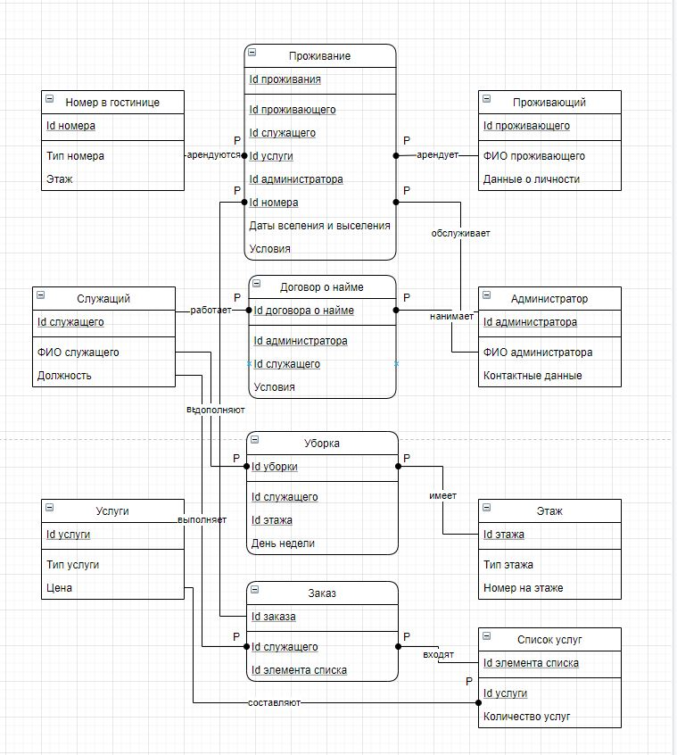

#Hotel

##Информационная система для гостиницы

Создать программную систему, предназначенную для администратора гостиницы.
Такая система должна обеспечивать хранение сведений об имеющихся в гостинице
номерах, о проживающих в гостинице клиентах и о служащих, убирающихся в номерах.
Количество номеров в гостинице известно, и имеются номера трех типов: одноместный (эконом),
двухместный (бизнес) и трехместный (супер бизнес), отличающиеся стоимостью проживания в сутки. В каждом
номере есть телефон.
О каждом проживающем должна храниться следующая информация: номер
паспорта, фамилия, имя, отчество, город, из которого он прибыл, дата поселения в
гостинице, выделенный гостиничный номер.
О служащих гостиницы должна быть известна информация следующего содержания:
фамилия, имя, отчество, где (этаж) и когда (день недели) он убирает. Служащий
гостиницы убирает все номера на одном этаже в определенные дни недели, при этом в
разные дни он может убирать разные этажи. 

СУБД: PostgreSQL