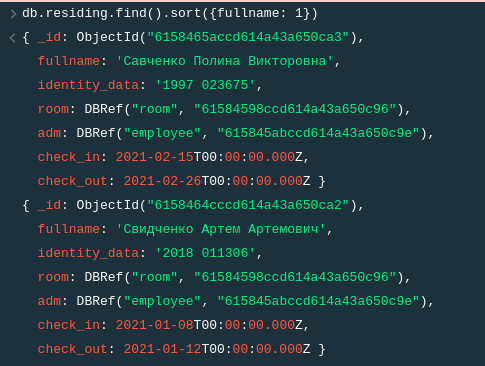

# Запросы

## 1. Вывести информацию о всех заключенных договорах на проживание, сортированную по ФИО проживающего
```

db.residing.find().sort({fullname: 1})
```


## 2. Вывести всех проживающих, которые заехали после 2021.01.10
```
db.residing.find({check_in: {$lte: new Date("2021-01-10")}})
```

## 3. Вывести всех проживающих, которые заехали после 2021.01.02, а выехали до 2021.01.15
```
db.residing.find({check_in: {$lte: new Date("2021-01-02), $gte: new Date("2021-01-15")}})
```

## 4. Вывести минимальную и максимальную цену за услугу гостиницы для тех услуг, цена которых не ниже 151
```
db.services.find({price: {$gte: 151}}, {price: 1}).sort({price: -1}).limit(1)
db.services.find({price: {$gte: 151}}, {price: 1}).sort({price: 1}).limit(1)
```

## 5. Вывести среднюю цену за услугу гостиницы
```
db.services.aggregate(
[
{
$group: { _id: null, avg: { $avg: "$price" } }
}
]
);

```

## 6. Вывести всех проживающих, которые получают услугу "Обогреватель"
```
db.services.find({type: "Обогреватель"})
```


## 7. Вывести максимальную цену за услугу гостиницы, цена которой больше 1000, если такая есть
```
db.services.find({price: {$gte: 1000}}, {price: 1}).sort({price: 1}).limit(1)
```

## 8. Вывести количество оказанных услуг типа "завтрак"
```
db.services.find({type: "Завтрак"}).count()
```
