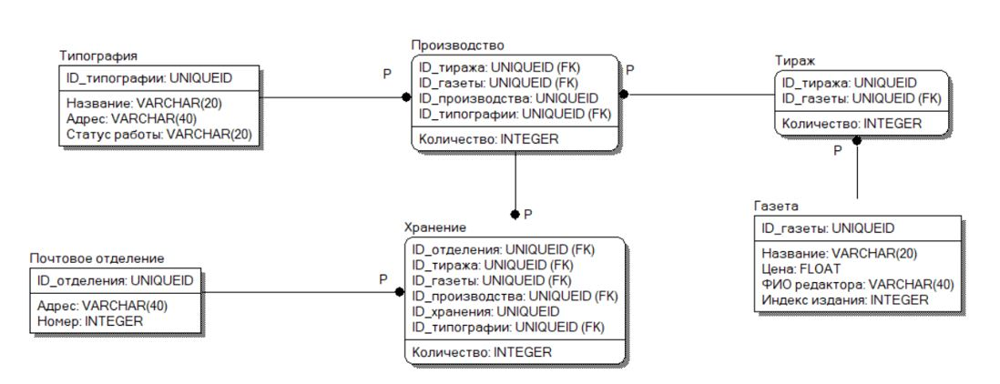

# Newspaper service

## База данных для отслеживания распределения по почтовым отделениям газет, печатеющихся в типографиях города
Сведения о газетах включают в себя: название газеты, индекс издания, фамилию, имя и отчество редактора, цену экземпляра газеты. Цены могут меняться. Возможно появление новых газет и изменение индекса существующего издания. Для типографий указываются их названия и адреса.
В типографии разными тиражами печатаются газеты нескольких наименований. Типография может быть закрыта, тогда необходимо скорректировать работу других типографий с учетом потребностей почтовых отделений в газетах.
Почтовое отделение имеет номер и адрес. На каждое почтовое отделение поступают в определенных количествах газеты разных наименований, причем часть экземпляров одной и той же газеты может быть напечатана в одной типографии, а часть – в другой.

СУБД: PostgreSQL
