# Запросы

###№1 
####Выбор газет, которые хранятся, где редактор 'Danilin Artem' с сортировкой по количеству. 
```
SELECT id_newspaper, name, price, full_name_editor, publication_index, id_production, 
        quantity FROM newspaper, production  WHERE full_name_editor = 'Danilin Artem' order by price;
```
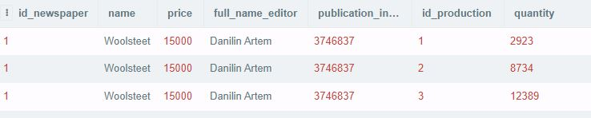
###№2
####Выбор почтовых отделений, которые находятся в городе 'SPb' и их номер > 1.
```
SELECT * FROM postoffice WHERE address = 'SPb' AND id_postoffice > 1;
```
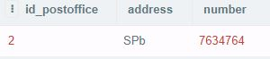
###№3 дат в таблице нет, заменил этот запрос на 4 + подзапрос + объединение запросов.
####Выбор хранения и производства(объединение), у которых адрес 'Moskva'.
```
SELECT id_storage, newspaper_id, circulation_id, typography_id, production_id, quantity, address, number FROM 
        storage INNER JOIN postoffice ON address IN (SELECT address from postoffice WHERE address = 'Moskva');
```
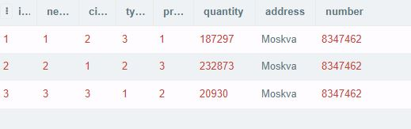
###№4.1
####Выбор газет и их редакторов с использованием функции смены регистра.
```
SELECT id_newspaper, LOWER(full_name_editor) AS FIO, publication_index, price FROM newspaper;
```
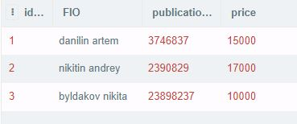
###№4.2
####Выбор почтовых отделений с использованием функции добавления указанных символов до определенной длины.
```
SELECT id_postoffice, number, LPAD(address, 30, '-')  AS address FROM postoffice;
```
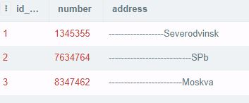
###№5.1 
####Выбор производств, в которых выпустили все тиражи.
```
SELECT id_production, newspaper_id, circulation_id, typography_id, quantity FROM production WHERE
        circulation_id IN (SELECT id_circulation FROM circulation);
```
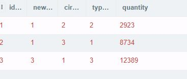 
###№5.2 + объединение + использование предикатов 
####Выбор тиража с производством, у которых количество тиража = '145' и типография принимает любое значение.
```
SELECT id_circulation, circulation.newspaper_id, circulation.quantity, typography_id FROM circulation RIGHT JOIN
        production ON id_circulation = circulation_id WHERE circulation.quantity = '145' 
               AND typography_id = SOME(SELECT id_typography FROM typography);
```

###№6 
####Вывод средней стоимости всех газет.
```
SELECT AVG(price) FROM newspaper;
```
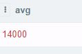
###№7.1 
####Выбор максимальной стоимости газеты, у которой редактор 'Danilin Artem' c сортировкой по номеру.
```
SELECT MAX(price) AS Max_price FROM newspaper GROUP BY id_newspaper HAVING full_name_editor in ('Danilin Artem');
```

###№7.2
####Выбор газет, у которых стоимость > 10000 с сортировкой по номеру.
```
SELECT * FROM newspaper GROUP BY id_newspaper HAVING SUM (price)> 10000;
```
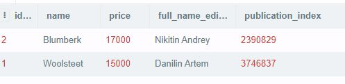
###№8 
####Выбор производств без повторений, которым соотвествует каждая газета.
```
SELECT id_production, newspaper_id, quantity FROM production
 	WHERE newspaper_id = SOME(SELECT id_newspaper FROM newspaper);
```
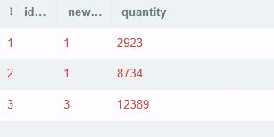
###№9 
####Выбор газет, которые хранятся и производстводятся в одном и том же месте(пересечение).
```
SELECT id_typography, name, address, id_storage, id_production, production.quantity 
        FROM typography, production, storage WHERE id_storage = id_production;
```
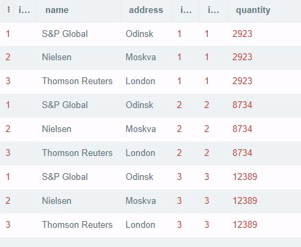
###№10.1 
####Выбор газет и соответсвующих им тиражей.(обьединение)
```
SELECT full_name_editor AS name, name, price, id_circulation, quantity
        FROM newspaper INNER JOIN circulation ON newspaper_id = id_newspaper;
```

###№10.2 
####Выбор газет и соответсвубщего хранения(исключение).
```
SELECT full_name_editor AS name, name, price, id_storage, quantity
        FROM newspaper INNER JOIN storage ON newspaper_id = id_newspaper;
```
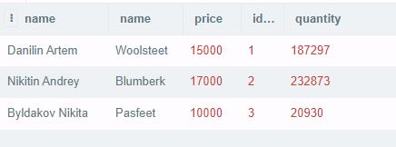
