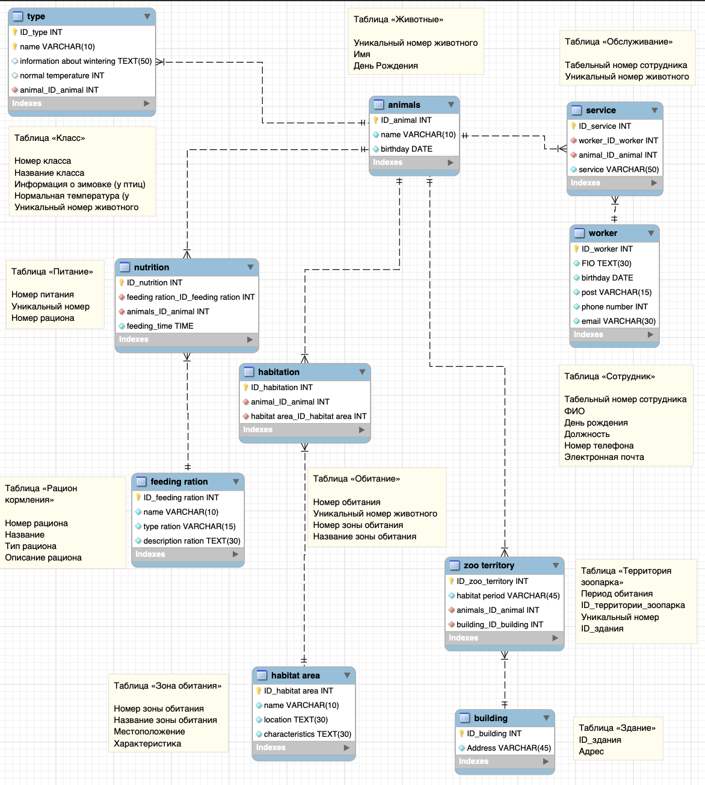

#Zoo

##Информационная система для учета животных в зоопарке

Создать программную систему, предназначенную для учета животных в зоопарке.
Каждому новому питомцу зоопарка присваивается уникальный номер, имя.
Необходимо также хранить дату рождения. О птицах дополнительно необходимо
хранить сведения о месте зимовки , для рептилий необходимо хранить сведения о его нормальной
температуре. Каждому питомцу назначается рацион кормления,
который характеризуется номером, названием, типом. Каждый тип рациона может содержать несколько рационов, отличающихся по
содержанию. Рацион может со временем меняться. Необходимо знать зону обитания
животного. Каждое животное относится к одной зоне обитания. В зоопарке есть ветеринары, которые закреплены за животными. Каждый
сотрудник имеет табельный номер, ФИО, дату рождения. Каждый ветеринар может
обслуживать несколько животных, и каждое животное может обслуживаться несколькими
ветеринарами. 

СУБД: PostgreSQL