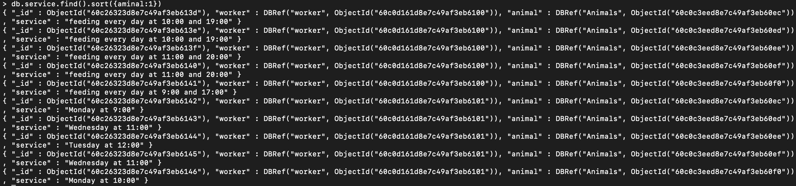
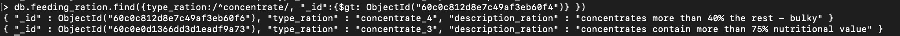
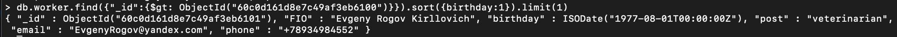
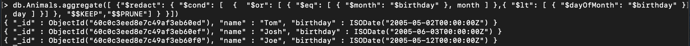

#Queries

### № 1 
####Вывести всех сотрудников с использованием функции смены регистра.
```
db.worker.aggregate([{$project: {FIO: {$toLower: "$FIO"}, post:1,phone:1}}])
```

### № 2
#### Вывести количество животных, у которых время питания между 10:34:00 и 12:35:00.
```
db.nutrition.find({feeding_time: {$gte: "10:34:00",$lte:"12:35:00"}}).count()
```

### № 3
####Вывести информацию о всех обслуживаниях, сортированную по именам животных.
```
db.service.find().sort({aminal:1})
```

### № 4
####Вывести всех сотрудников, заменив все пробелы в ФИО на "_".
```
db.worker.aggregate([{$project:{FIO:{$replaceAll:{input:"$FIO", find:" ",replacement:"_"}}}}]).pretty()
```

### № 5
####Вывести информацию о рационах питания под названием "concentrate", у котрых номер рациона больше 2.
```
db.feeding_ration.find({type_ration:/^concentrate/, "_id":{$gt: ObjectId("60c0c812d8e7c49af3eb60f4")} })
```

### № 6
####Вывести информацию о самом страшем сотруднике среди сотрудников, у которых id больше 2.
```
db.worker.find({"_id":{$gt: ObjectId("60c0d161d8e7c49af3eb6100")}}).sort({birthday:1}).limit(1)
```

### № 7
####Вывести информацию о сотрудниках, которые родились позже 1979 года.
```
db.worker.find({birthday:{$gt: ISODate("1979-12-31T23:59:59.132Z")}})
```

### № 8
####Вывести день, месяц и год рождения животных, которые родились в июне или до 13 числа любого месяца.
```
var month = 6
var day = 13

db.Animals.aggregate([ {"$redact": { "$cond": [  {  "$or": [ { "$eq": [ { "$month": "$birthday" }, month ] },{ "$lt": [ { "$dayOfMonth": "$birthday" }, day ] }] }, "$$KEEP","$$PRUNE"] } }])
```
