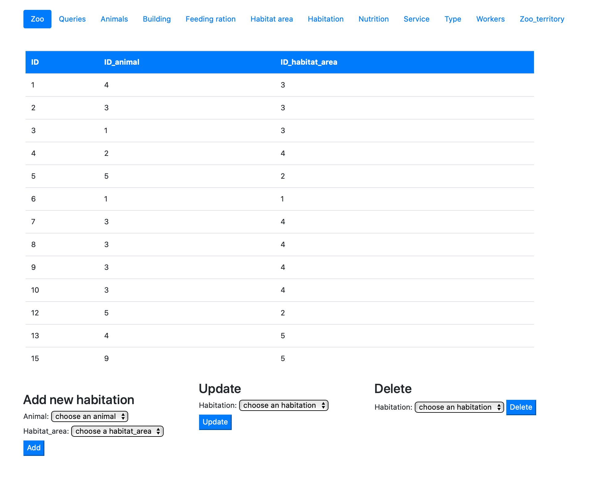
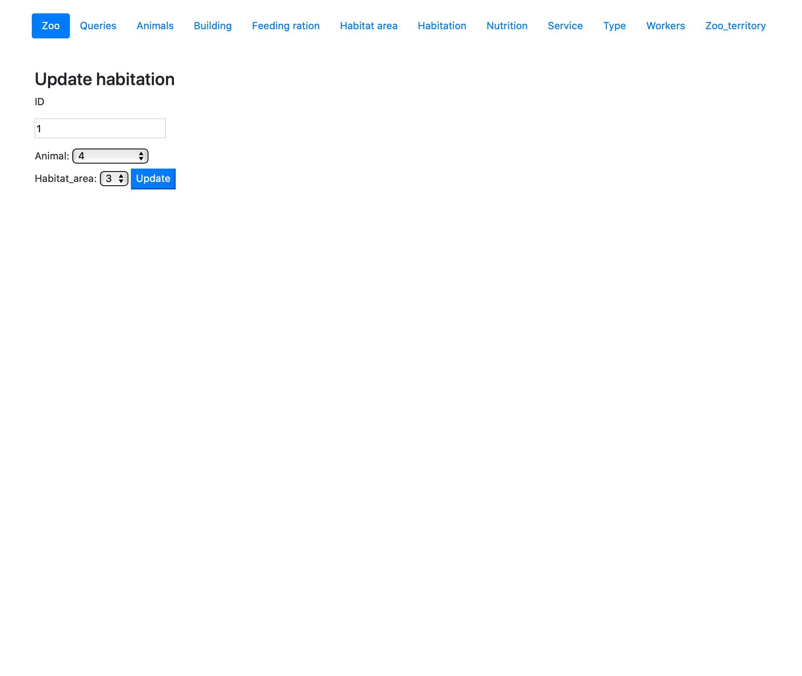

# Страница Habitation

На странице Habitation представлена информация о том в какой зоне обитания проживает каждое животное. Кроме предоставления информации данная страница предоставляет возможность добавлять, удалять и редоктировать данные.

При обновлении о проживании животного в зоне обитания можно изменить животного и зону обитания.
