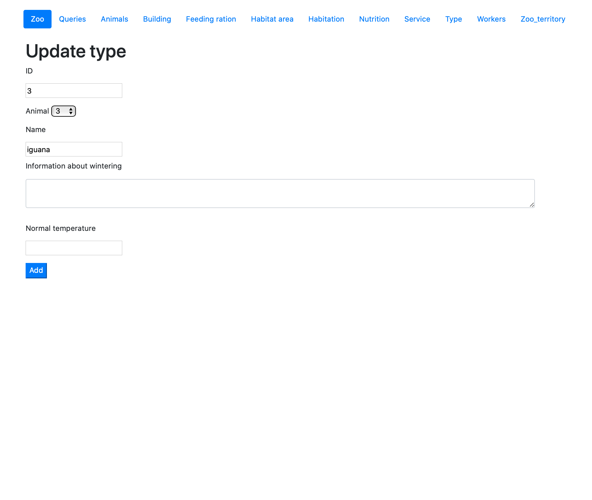

# Страница Type 

На странице Type представлена информация о типе животных. Кроме предоставления информации данная страница предоставляет возможность добавлять, удалять и редоктировать данные.

При обновлении информации в таблице Type можно изменить  животное, название типа, информацию о зимовке и о нормальной температуре.
