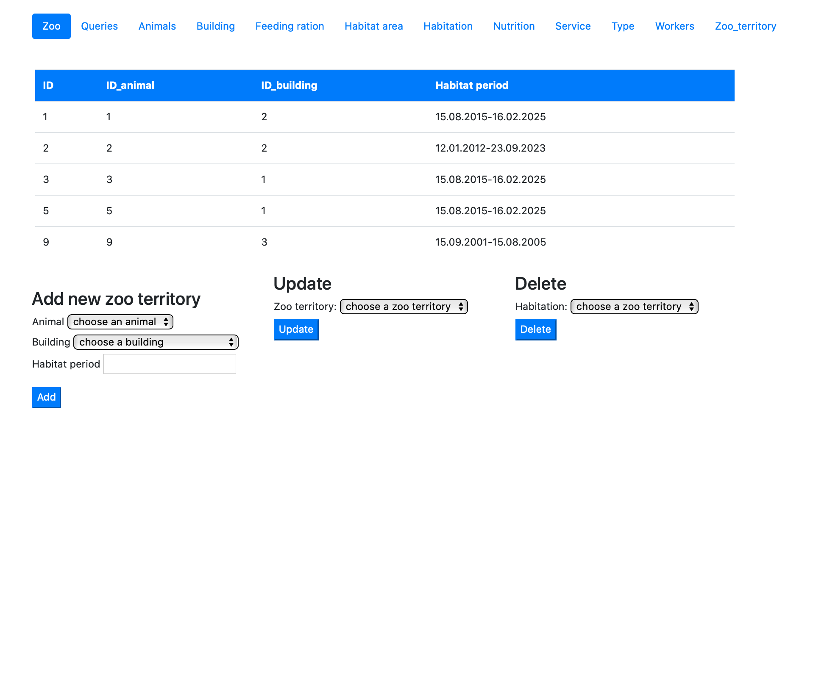
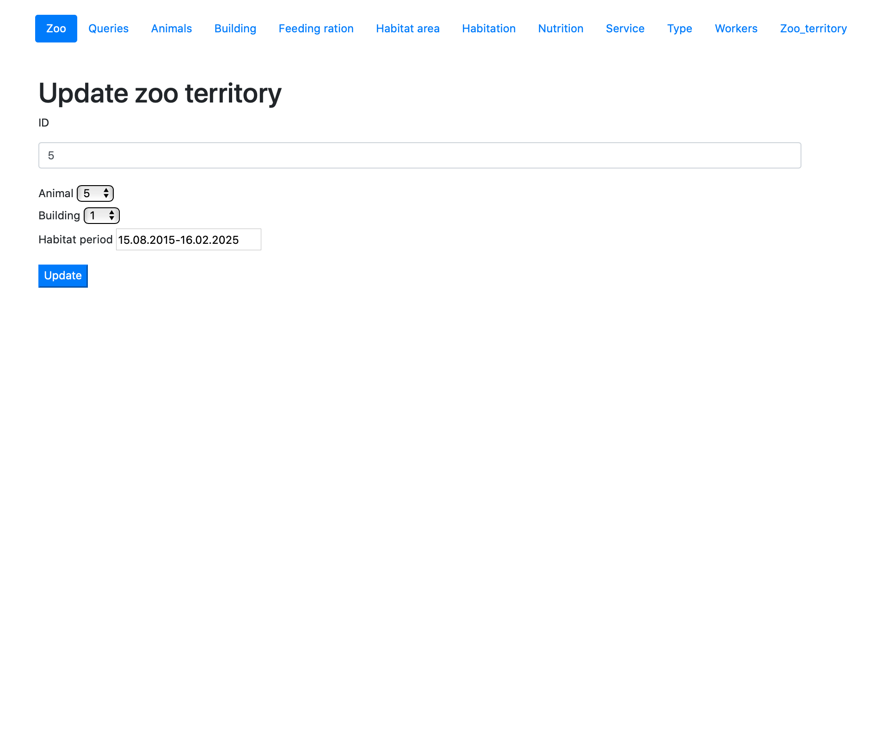

# Страница Zoo territory 

На странице territory представлена информация о том где проживают животные на территории зоопарка. Кроме предоставления информации данная страница предоставляет возможность добавлять, удалять и редоктировать данные.

При обновлении информации в таблице territory можно изменить животное, здание и период обитания.
