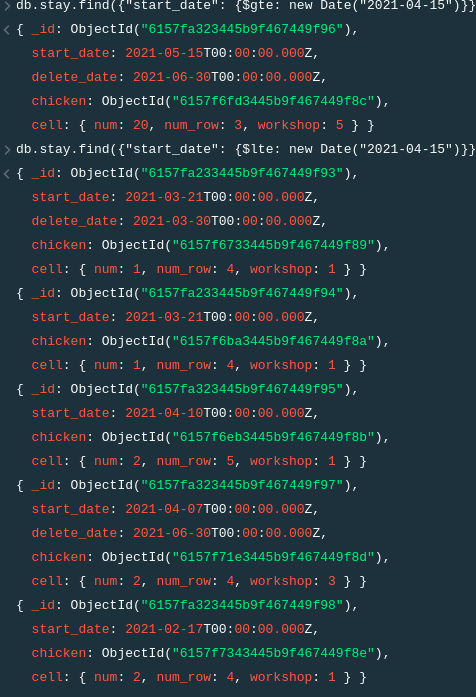
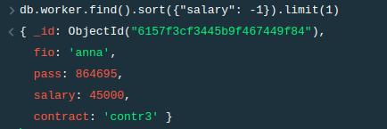
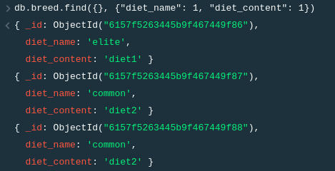
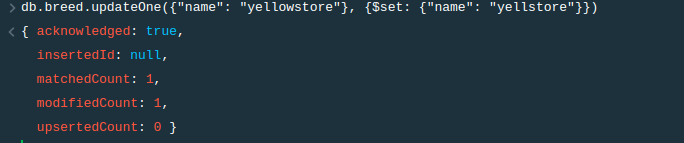
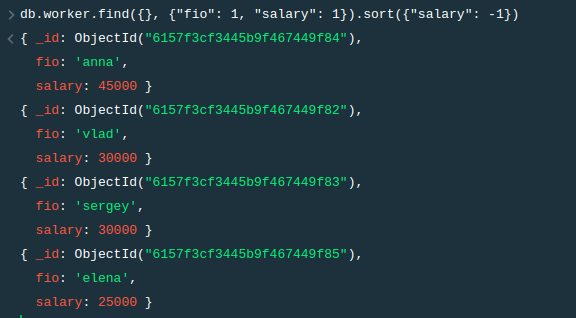

## Запросы

# 1 - Вывод информации о пребывании куриц, которых заселили в апреле до 15 числа
```
db.stay.find({"start_date": {$lte: new Date("2021-04-15")}})
```



# 2 - Вывод информации о работнике с максимальной зп
```
db.worker.find().sort({"salary": -1}).limit(1)
```



# 3 - Вывод информции о диете для каждой породы
```
db.breed.find({}, {"diet_name": 1, "diet_content": 1})
```



# 4 - Изменить название породы yellowstore на yellstore
```
db.breed.updateOne({"name": "yellowstore"}, {$set: {"name": "yellstore"}})
```



# 5 - Вывод инфомации ФИО и зп работников, сортировка по убыванию
```
db.worker.find({}, {"fio": 1, "salary": 1}).sort({"salary": -1})
```

