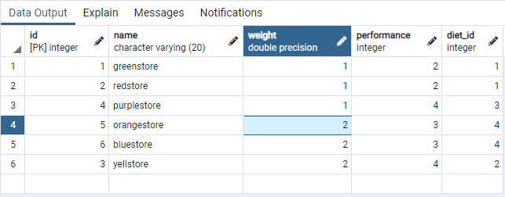

###Запросы
# 1 - Вывод информации о курицах, вес которых превышает вес породы
```
select id as id_chicken, weight from workplace.chicken where weight > all (select weight from workplace.breed);
```

# 2 - Вывод информации о том, какие породы находятся в клетке 2
```
select * from workplace.breed where id in (select breed_id from workplace.chicken where id in 
										   (select chicken_id from workplace.stay where cell_id = 2));
```

# 3 - Вывод информации о пребывании куриц, которых заселили в апреле до 15 числа
```
select * from workplace.stay where (select extract(day from date_start)<15
									and extract(month from date_start) =4);
```

# 4 - Вывод информации о работнике с максимальной зп
```
select * from workplace.worker where salary>=all
(select salary from workplace.worker);
```

# 5 - Вывод информации о расположении клеток, обслуживаемых работником по имени Сергей
```
select distinct
fio, workshop_id, num, num_row
from
workplace.worker,
workplace.cell,
workplace.serving
where worker.fio = 'sergey'
and worker.id = serving.worker_id
and cell.id = serving.cell_id;
```

# 6 - Вывод информации о работниках, которые хоть раз обслуживали клетки
```
select fio from workplace.worker
where id in
(select workplace.serving.worker_id from workplace.serving);
```

# 7 - Вывести id куриц и информацию о возрасте, 'young' если возраст курицы меньше 1, 'old' в остальных случаях
```
select id,
	case
		when age > 1
			then 'old'
			else 'young'
		end as category_chicken
		from workplace.chicken;
```

# 8 - Изменить название породы yellowstore на yellstore
```
UPDATE workplace.breed
SET name = 'yellstore'
WHERE name = 'yellowstore';
```


# 9 - Удалить записи об обслуживаниях работника по имени Владимир
```
DELETE FROM workplace.serving
  WHERE worker_id
  	IN (
		SELECT id FROM workplace.worker
		WHERE fio ='vladimir');
```

# 10 -Вывод инфомации ФИО и зп работников, сортировка по убыванию
```
select fio, salary from workplace.worker
order by fio desc;
```

# 11 - Вывод информции о диете для каждой породы
```
select distinct diet.name, diet.content, breed.name, breed.diet_id
 from workplace.diet
left join workplace.breed
on breed.diet_id
= diet.id;
```


# 12 -  Удалить работников из бд, которые ни разу не обслуживали клетки
```
delete from workplace.worker
where id
not in (select worker_id
		from workplace.serving);
		
select * from workplace.worker;
```


