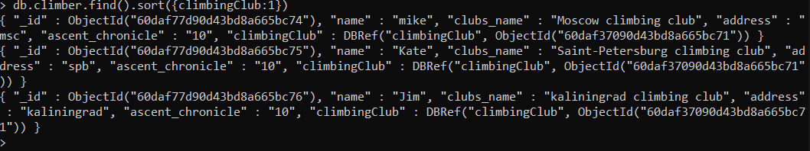
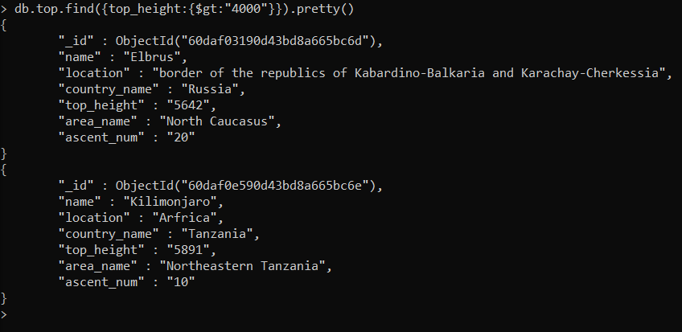

##Queries
#### Вывести информацию о всех альпинистах, сортированную по названию альпинистского клуба:
```
> db.climber.find().sort({climbingClub:1})
```

####Вывести всех сотрудников с использованием функции смены регистра.
```
> db.climber.aggregate([{$project:{name:{$toLower:"$name"}}}])
```

####Вывести вершины, у которых высота >4000
```
> db.top.find({top_height:{$gt:"4000"}}).pretty()
```

####Вывести восхождения за 2020 год
```
> db.ascent.find({ascent_date:{$gte:"2020-01-01", $lte:"2020-12-31"}})
```

