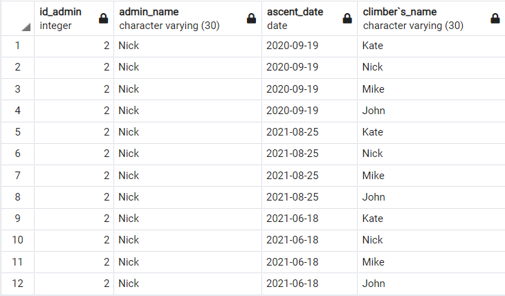
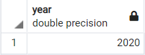
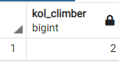
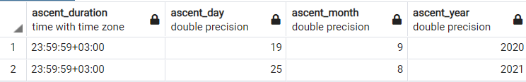
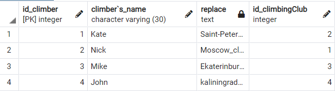
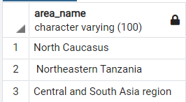
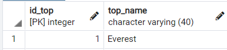
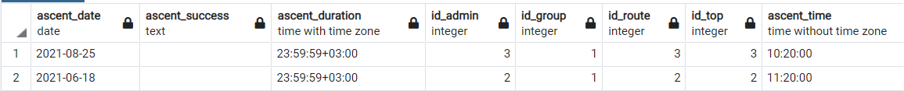
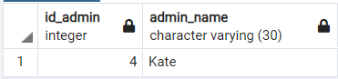

##Select
#### Вывести информацию о всех вершинах, отсортированную по высоте вершины, где количество восхождений больше 15:
```
select top.top_name, top.location,top.top_height, top.country_name,route.route_description  from top, route where(ascent_num>15) order by top.top_height;
```

#### Вывести информацию о всех группе, имя альпиниста и дату восхождения, которым занимался третий администратор, отсортированную по именам альпинистов:
```
select "group".id_group, "group".group_name, climber."climber`s_name", ascent.ascent_date from "group", climber, ascent where(ascent.id_admin=3) order by climber."climber`s_name";
```

#### Вывести информацию основную информацию о вершине, у которой название начинается на "E" и имеет больше 20 восхождений
```
select top.top_name, top.country_name, top.top_height from top where(top.top_name L from IKE 'E%') and(top.ascent_num>20);
```

#### Вывести информацию основную информацию о альпинисте, который из Москвы или Санкт-Петербурга, или его имя начинается на N
```
select climber.id_climber, climber."climber`s_name", climber."id_climbingClub" from climber where((climber.adress='msc') or(climber.adress='spb')) or((climber."climber`s_name" LIKE 'K%') or (climber."climber`s_name" LIKE 'N%'));
```

#### Вывести информацию о восхождении , которое было после 2020 года
```
select *from ascent where(EXTRACT(year FROM ascent_date)>2020);
```

#### Вывести длительность восхождения, день, месяц и год восхождения, где месяц сентябрь или день восхождения после 18
```
select ascent.ascent_duration, EXTRACT (DAY from ascent_date) as ascent_day, EXTRACT(MONTH from ascent_date) as ascent_month, EXTRACT(YEAR from ascent_date) as ascent_year from ascent where EXTRACT(MONTH from ascent_date)=9 or EXTRACT(day from ascent_date) > 18;
```

#### Вывести основную информацию об альпинисте и его имя в верхнем регистре
```
select id_climber, UPPER("climber`s_name"), "club`s_name", climber."id_climbingClub" from climber;
```

#### Вывести id альпиниста и его имя, заменив пробелы в названии альпинистского клуба на нижнее подчеркивание, а также вывести id альпинистского клуба, где имя альпиниста в верхнем регистре или первая буква имени в верхнем регистре
```
select id_climber,"climber`s_name", REPLACE("club`s_name",' ','_'), climber."id_climbingClub" FROM climber where "climber`s_name"=UPPER("climber`s_name") or "climber`s_name"=INITCAP("climber`s_name")
```


#### Вывести id и имя администратора, дату восхождения, имя альпиниста, где id админа больше одногои часы из времени восхождения больше 10 
```
select admin.id_admin, admin.admin_name, ascent.ascent_date, climber."climber`s_name" from admin, ascent, climber where admin.id_admin in(select id_admin from ascent where(id_admin>1) and(EXTRACT(HOUR FROM ascent_time)>'10'));
```

#### Вывести количество вершин, где количество восхождений между 5 и 20
```
select count(id_top) as kol_top from top where ascent_num BETWEEN 5 and 20;
```

#### Вывести самое раннее восхождение, где время восхождения после 11
```
select min(EXTRACT(year FROM ascent_date)) as YEAR from ascent where ascent_time>'11:00:00';
```

#### Вывести количество альпинистов, которых количество восхождений на эверест равняется одному или id альпиниста больше 1
```
select count(climber.id_climber) as kol_climber from climber where(climber.ascent_chronicle LIKE 'Everest-1%') and id_climber in (select id_climber from "groupComposition" where id_climber>1);
```


#### Вывести название местности вершины, у котрой есть маршрут
```
select area_name from top where exists(select * from route where top.id_top = route.id_top);
```

#### Вывести информацию о вершине где id вершины
```
select id_top, top_name from top where id_top = any (SELECT id_top from top where top_height>6000);
```

#### Вывести информацию о восхождении, где дата восхождения между '01.08.2020' и '31.08.2021', и пустое поле успешности восхождения
```
SELECT *from ascent where ascent_date between '01.08.2020' and '31.08.2021' INTERSECT SELECT *from ascent where ascent_success not in (SELECT ascent_success from ascent where ascent_success ='successfully');
```

#### Вывести информацию об админах, которые не организовывали восхождения
```
SELECT * from admin EXCEPT SELECT *from admin where admin.id_admin in (SELECT id_admin from ascent);*
```
