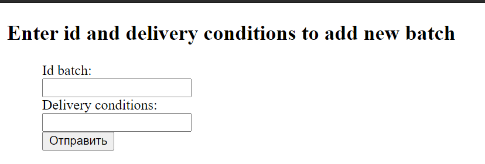
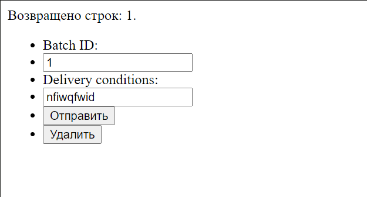
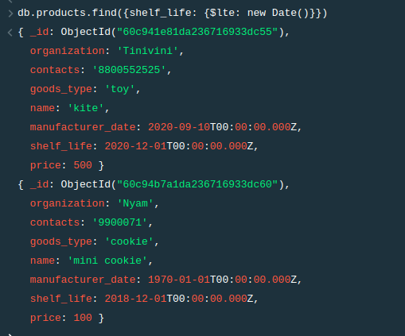

#**Документация для бд**
##**Описание**
На торги могут быть представлены разные товары одной и той же фирмы и одни и
те же товары разных фирм. Каждый товар имеет свой уникальный код, произведен
определенной формой в определенное время. Товар имеет гарантийный срок хранения,
единицу измерения. Товар считается просроченным, если дата его отгрузки более поздняя,
чем дата производства этого товара в сумме с гарантийным сроком хранения. Товары
поставляются партиями. Партия характеризуется: номером, количеством единиц в партии,
ценой поставляемого товара, условиями поставки (предоплата или нет). Партии товаров
выставляют брокеры. В одну партию товаров включаются разнообразные товары от
разных производителей. Считается, что партии товаров, выставленные на продажу,
покупает сама биржа, и она же расплачивается с брокером и производителями товара.
Если условием поставки указана предоплата, то биржа перечисляет деньги в день
заключения договора, а если нет — то в день отгрузки.
Брокеры работают за фиксированный процент прибыли — 10% от суммы
заключенных сделок. Ежемесячно брокеры перечисляют конторе, в которой они
работают, фиксированную сумму денег, а все остальные заработанные ими деньги
составляют их чистый доход (зарплату).
##**Модель БД**

##**Создание таблиц**
##batch
| Поле | Тип данных | PK | FK | Null | Описание | 
|:----:|:----------:|:--:|:--:|:----:|:--------:|
| id_batch | int    | ☑ | ☐ | ☐ | id партии |
| delievery_conditions | character varying [] | ☐ | ☐ | ☑ | условия доставки |

``` sql
CREATE TABLE batch (
    id_batch integer NOT NULL,
    delivery_conditions character varying[150] NOT NULL
    PRIMARY KEY (id_batch)
);
```

##broker
| Поле | Тип данных | PK | FK | Null | Описание | 
|:----:|:----------:|:--:|:--:|:----:|:--------:|
| id_broker | int   | ☑ | ☐ | ☐ | id брокера |
| company_payments | int   | ☑ | ☐ | ☑ | отчисления конторе |
| name_broker | character varying[]| ☐ | ☐ | ☐ | Имя брокера|
| income | int| ☐ | ☐ | ☑ | доход |

``` sql
CREATE TABLE broker (
    id_broker integer NOT NULL,
    company_payments integer NOT NULL,
    name_broker character varying[150] NOT NULL,
    income integer
    PRIMARY KEY id_broker
);
```

##customer
| Поле | Тип данных | PK | FK | Null | Описание | 
|:----:|:----------:|:--:|:--:|:----:|:--------:|
| id_customer | int | ☑ | ☐ | ☐ | id покупателя |
| name_customer | character varying[] | ☐ | ☐ | ☐ | имя покупателя |

``` sql
CREATE TABLE customer (
    id_customer integer NOT NULL,
    name_customer character varying[150] NOT NULL
    PRIMARY KEY  id_customer
);
```

##manufactory
| Поле | Тип данных | PK | FK | Null | Описание | 
|:----:|:----------:|:--:|:--:|:----:|:--------:|
| id_manufactory | int| ☑ | ☐ | ☐ | id производителя |
| name_manufactory | character varying[] | ☐ | ☐ | ☐ | название производителя |
| specialization | character varying[]| ☐ | ☐ | ☐ | специализация|
| contacts | character varying[]| ☐ | ☐ | ☐ | контакты|

``` sql
CREATE TABLE manufactory (
    id_manufactory integer NOT NULL,
    name_manufactory character varying[150] NOT NULL,
    specialization character varying[150],
    contacts character varying[150] NOT NULL
    PRIMARY KEY (id_manufactory)
);
```

##manufacter_product
| Поле | Тип данных | PK | FK | Null | Описание | 
|:----:|:----------:|:--:|:--:|:----:|:--------:|
| id_manufacter_product | int| ☑ | ☐ | ☐ | id продукта |
| type | character varying[] | ☐ | ☐ | ☐ | тип продукта |
| id_manufacter | int| ☐ | ☑ | ☐ | id производителя|

``` sql
CREATE TABLE manufacter_product (
    id_manufactory integer NOT NULL REFERENCES product ()id_product),
    type_manufactory_product character varying[150] NOT NULL,
    id_manufactory_product integer NOT NULL
    PRIMARY KEY (id_manufactory_product)
);
```

##office
| Поле | Тип данных | PK | FK | Null | Описание | 
|:----:|:----------:|:--:|:--:|:----:|:--------:|
| id_office | int| ☑ | ☐ | ☐ | id конторы |
| name_office | character varying[] | ☐ | ☐ | ☐ | название конторы |
| contacts_office | character varying[]| ☐ | ☐ | ☐ | контакты конторы|
| id_broker | int| ☐ | ☑ | ☐ | id брокера|

``` sql
CREATE TABLE office (
    id_office integer NOT NULL,
    name_office character varying[150] NOT NULL,
    contacts_office character varying[150] NOT NULL,
    id_broker integer NOT NULL REFERENCES broker (id_broker),
    PRIMARY KEY (id_office)
);
```

##product
| Поле | Тип данных | PK | FK | Null | Описание | 
|:----:|:----------:|:--:|:--:|:----:|:--------:|
| id_product | int| ☑ | ☐ | ☐ | id продукта |
| name_product | character varying[] | ☐ | ☐ | ☐ | название продукта |
| date | timestamp| ☐ | ☐ | ☐ | дата производства|
| shelf_life | interval| ☐ | ☐ | ☐ | срок годности|
| unit | char[]| ☐ | ☐ | ☐ | единица измерения|

``` sql
CREATE TABLE product (
    id_product integer NOT NULL,
    name character varying[150] NOT NULL,
    date timestamp NOT NULL,
    shelf_life interval NOT NULL,
    unit character(10) NOT NULL
    PRIMARY KEY (id_product)
);
```

##product_in_batch
| Поле | Тип данных | PK | FK | Null | Описание | 
|:----:|:----------:|:--:|:--:|:----:|:--------:|
| id_product | int| ☑ | ☐| ☐ | id продукта |
| name_product_in_batch | character varying[] | ☐ | ☐ | ☐ | название продукта в партии |
| quantity | int | ☐ | ☐ | ☐ | количество|
| id_batch | int| ☐ | ☑ | ☐ | id партии|

``` sql
CREATE TABLE product_in_batch (
    id_product integer NOT NULL,
    name_product_in_batch character varying[150] NOT NULL,
    quantity integer NOT NULL,
    id_batch integer NOT NULL REFERENCES batch (id_batch)
);
```


##stock
| Поле | Тип данных | PK | FK | Null | Описание | 
|:----:|:----------:|:--:|:--:|:----:|:--------:|
| id_stock | int| ☑ | ☐| ☐ | id биржи |
| name_stock | character varying[] | ☐ | ☐ | ☐ | название биржи |
| contacts | character varying[] | ☐ | ☐ | ☐ | контакты|

``` sql
CREATE TABLE stock (
    id_stock integer NOT NULL,
    name_stock character varying[150] NOT NULL,
    contacts character varying[150] NOT NULL
    PRIMARY KEY (id_stock)
);
```
##deal
| Поле | Тип данных | PK | FK | Null | Описание | 
|:----:|:----------:|:--:|:--:|:----:|:--------:|
| id_deal | int| ☑ | ☐| ☐ | id сделки |
| deal_date | date | ☐ | ☐ | ☐ | дата сделки |
| id_broker | int | ☐ | ☑ | ☐ | id брокера|
| id_batch | int | ☐ | ☑ | ☐ | id партии|
| id_customer | int | ☐ | ☑ | ☐ | id покупателя|
| payment_status | boolean | ☐ | ☐ | ☐ | статус оплаты|
| payment_summ | int | ☐ | ☐ | ☐ | сумма оплаты|
| payment_type | char[] | ☐ | ☐ | ☐ | тип оплаты|

``` sql
CREATE TABLE deal (
    id_deal integer NOT NULL,
    deal_date date NOT NULL,
    id_broker integer NOT NULL REFERENCES broker (id_broker),
    id_batch integer NOT NULL REFERENCES batch (id_batch),
    id_customer integer NOT NULL REFERENCES customer (id_customer),
    deal_status boolean NOT NULL,
    payment_status boolean NOT NULL,
    payment_summ integer NOT NULL,
    payment_type character varying[30] NOT NULL
    PRIMARY KEY (id_deal)
);
```
##**Запросы**
###*№1*
###**Выводит информацию о количестве продукта в партии, имя и сортирует по возрастанию**
###*Код запроса*
```sql
Select product_in_batch.quantity, product.name_product, batch.id_batch
FROM product_in_batch, product, batch
WHERE (product_in_batch.id_product = product.id_product and product_in_batch.id_batch = batch.id_batch)
ORDER BY product_in_batch.quantity ASC;
```
###*Пример получившихся данных*
| quantity | name_product | id_batch |
|:----:|:----------:|:--:|
| 200 | Friend| 1 |

###*№2*
###**Выводит информацию о брокерах, чей доход больше 50000 и выплаты компании больше 30000**
###*Код запроса*
```sql
SELECT * FROM broker
WHERE (broker.company_payments > 30000 and broker.income > 50000);
```
###*Пример получившихся данных*
| id_broker | company_payments | name_broker | income |
|:----:|:----------:|:--:|:--:|
| 3 | 60000| Debik | 70000 |

###*№3*
###**Выводит список продуктов с истёкшим сроком годности**
###*Код запроса*
```sql
SELECT * from product
WHERE (product.date_product + product.shelf_life > now());
```
###*Пример получившихся данных*
| id_product | name_product | date_product | unit | shelf_life |
|:----:|:----------:|:--:|:--:|:--:|
| 3 | Lel| 2021-03-23 | pics | 3 years|

###*№4*
###**Выводит список брокеров и офис, где они работают, чьё имя начинается на "J" и чьи выплаты компании больше меньше 100000**
###*Код запроса*
```sql
SELECT broker.company_payments, broker.name_broker, broker.id_broker, office.name_office
FROM broker
INNER JOIN office
ON broker.id_broker = office.id_broker
WHERE (substring(broker.name_broker from 1 for 1) = 'J' and broker.company_payments < 100000);
```
###*Пример получившихся данных*
| company-payments | name_broker | id_broker | name_office |
|:----:|:----------:|:--:|:--:|
| 10000 | John | 1 | office1 |

###*№5*
###**Выводит список сделок брокеров, чьи выплаты компании выше средних**
###*Код запроса*
```sql
SELECT deal.id_deal, deal.deal_status, deal.payment_summ, deal.deal_date
FROM deal
INNER JOIN broker
ON deal.id_broker = broker.id_broker
WHERE broker.company_payments > (SELECT AVG(broker.company_payments) FROM broker);
```
###*Пример получившихся данных*
| id_deal | deal_status | payment_summ | deal_date |
|:----:|:----------:|:--:|:--:|
| 3 | True | 3000000 | 2021-03-23 |

###*№6*
###**Выводит информацию о продуктах в партии, чьё количество больше среднего**
###*Код запроса*
```sql
SELECT product_in_batch.name_product_in_batch, product_in_batch.quantity
FROM product_in_batch
INNER JOIN batch
ON product_in_batch.id_batch = batch.id_batch
INNER JOIN product
ON product.id_product = product_in_batch.id_product
WHERE product_in_batch.quantity > (SELECT AVG(product_in_batch.quantity) FROM product_in_batch)
GROUP BY product_in_batch.name_product_in_batch, product_in_batch.quantity
HAVING max(product_in_batch.quantity) > 300; 
```
###*Пример получившихся данных*
| id_deal | deal_status |
|:----:|:----------:|
| product3 | 400 |

###*№7*
###**Выводит список всех состоявшихся сделок, с типо оплаты "cash"**
###*Код запроса*
```sql
SELECT * from deal
WHERE (deal.payment_status IS NOT FALSE and deal.payment_type = 'cash');
```
###*Пример получившихся данных*
| id_deal | deal_date | id_broker | id_batch | id_customer | deal_status | payment_status| payment_summ |payment_type |
|:----:|:----------:|:--:|:--:|:----:|:----------:|:--:|:--:|:--:|
| 1 | 2021-02-23 | 1 | 1 | 1 | true | true | 10000000 |cash | 

###*№8*
###**Выводит список производств, чья специализация существует и начинается на "g"**
###*Код запроса*
```sql
SELECT *
FROM manufactory
WHERE (EXISTS (SELECT manufactory.specialization from manufactory) 
       and substring(manufactory.name_manufactory from 1 for 1) = 'g');
```
###*Пример получившихся данных*
| id_manufactory | name_manufactory| spezialization | contacts | 
|:----:|:----------:|:--:|:--:|
| 1 | gostrah | Sizhki | 88005553535 | 

###*№9*
###**Выводит список сделок, совершившённых брокером 1 за последний год**
###*Код запроса*
```sql
Select deal.id_broker, broker.name_broker from deal
INNER JOIN broker
ON deal.id_broker = broker.id_broker
WHERE (deal.deal_date + interval '1 year' < now() and deal.id_broker = 1);
```
###*Пример получившихся данных*
| id_broker | name_broker| 
|:----:|:----------:|
| 1 | John |

###*№10*
###**Выводит id сделки и покупателя "Daun", в случае если сумма сделки выше средней и сделка состоялась**
###*Код запроса*
```sql
SELECT deal.id_deal, customer.id_customer  from deal
INNER JOIN customer
ON customer.name_customer = 'Daun'
WHERE (deal.payment_summ > (SELECT AVG(deal.payment_summ) from deal) and deal.payment_status IS NOT FALSE)
ORDER BY deal.payment_summ ASC;
```
###*Пример получившихся данных*
| id_broker | name_broker| 
|:----:|:----------:|
| 1 | John |

###*№11*
###**Выводит id сделки, id брокера, сумму сделки и отчисления брокера в контору, если сумма отчислений выше средней и сумма сделки выше средней**
###*Код запроса*
```sql
SELECT deal.id_deal, deal.payment_summ, broker.id_broker, broker.company_payments from deal
LEFT OUTER JOIN broker
ON broker.company_payments > SOME(SELECT AVG(broker.company_payments) FROM broker)
WHERE (deal.payment_summ > ANY(SELECT AVG(deal.payment_summ) FROM deal));
```
###*Пример получившихся данных*
| id_deal | payment_summ| id_broker | company_payments|
|:----:|:----------:|:----:|:----------:|
| 2 | 5000000 | 3 | 60000 |

##**Веб-приложение с использованием базы данных**
###*Добавить запись в базу данных*
URL: http://localhost/ivan/batch_add.html
Скриншот:

###*Поиск, редактирование и удаление записей из базы данных*
URL: http://localhost/ivan/batch_search.html
Скриншоты:



## Mongodb: процесс реализации модели


# Коллекция продуктов компаний
```
>db.products.insertOne({
    'organization': 'Tinivini', 
    'contacts': '8800552525', 
    'goods_type': 'toy', 
    'name': 'kite',
    'manufacturer_date': new Date("2020-09-10"), 
    'shelf_life': new Date("2020-12-01"), 
    'price': 500
})
{ acknowledged: true,
  insertedId: ObjectId("60c941e81da236716933dc55") }

>db.products.insertOne({
    'organization': 'Asura', 
    'contacts': '9982971', 
    'goods_type': 'books', 
    'name': 'Techno manga',
    'manufacturer_date': new Date("2018-08-00"), 
    'shelf_life': new Date("2025-12-01"), 
    'price': 300
})
{ acknowledged: true,
  insertedId: ObjectId("60c9423f1da236716933dc56") }

>db.products.insertOne({
    'organization': 'Asura', 
    'contacts': '9982971', 
    'goods_type': 'books', 
    'name': 'Elf manga',
    'manufacturer_date': new Date("2019-08-00"), 
    'shelf_life': new Date("2026-12-01"), 
    'price': 350
})
{ acknowledged: true,
  insertedId: ObjectId("60c942681da236716933dc57") }


>db.products.insertOne({
    'organization': 'Nyam', 
    'contacts': '9900071', 
    'goods_type': 'cookie', 
    'name': 'mini cookie',
    'manufacturer_date': new Date("2017-08-00"), 
    'shelf_life': new Date("2018-12-01"), 
    'price': 100
})
{ acknowledged: true,
  insertedId: ObjectId("60c94b7a1da236716933dc60") }

>db.products.insertOne({
    'organization': 'Kansai', 
    'contacts': '8929937', 
    'goods_type': 'bed', 
    'name': 'wooden bed',
    'manufacturer_date': new Date("2015-10-00"), 
    'shelf_life': new Date("2022-12-01"), 
    'price': 10000
})
{ acknowledged: true,
  insertedId: ObjectId("60c942b91da236716933dc58") }
```

# Коллекция брокеров
```
>db.broker.insertOne({
    'company': 'Bestie', 
    'contacts': '826397223', 
    'name': 'Harly Joy', 
    'income': new Date("2015-11-14")
})
{ acknowledged: true,
  insertedId: ObjectId("60c943361da236716933dc59") }


>db.broker.insertOne({
    'company': 'Bestie', 
    'contacts': '826397223', 
    'name': 'Mery Ly', 
    'income': new Date("2020-07-14")
})
{ acknowledged: true,
  insertedId: ObjectId("60c9435b1da236716933dc5a") }

>db.broker.insertOne({
    'company': 'Shine', 
    'contacts': '8887266610', 
    'name': 'Jhon Shini', 
    'income': new Date("2021-01-07")
})
{ acknowledged: true,
  insertedId: ObjectId("60c943951da236716933dc5b") }

>db.broker.insertOne({
    'company': 'Shine', 
    'contacts': '8887266610', 
    'name': 'Cary Smith', 
    'income': new Date("2011-04-03")
})
{ acknowledged: true,
  insertedId: ObjectId("60c943c31da236716933dc5c") }
```

# Коллекция сделок
```
>var id_product = db.products.findOne({'name': 'Elf manga'})._id
>var id_broker = db.broker.findOne({'name': 'Cary Smith'})._id
>db.deal.insertOne({
    'date': new Date("2020-12-10"), 
    'customer_name': 'Mary Smith', 
    'payment_status': true,
    'payment_type': 'cash', 
    'sum': 10000,
    'batch': {
        'conditions': 'something important', 
        'quantity': 100, 
        'product': new DBRef("products", id_product)
    }, 
    'broker': new DBRef('broker', id_broker)
})
{ acknowledged: true,
  insertedId: ObjectId("60c944d71da236716933dc5d") }

>var id_product = db.products.findOne({'name': 'Techno manga'})._id
>var id_broker = db.broker.findOne({'name': 'Cary Smith'})._id
>db.deal.insertOne({
    'date': new Date("2021-01-08"), 
    'customer_name': 'Mary Smith', 
    'payment_status': true,
    'payment_type': 'virtual', 
    'sum': 1150000,
    'batch': {
        'conditions': 'something important', 
        'quantity': 1150, 
        'product': new DBRef("products", id_product)
    }, 
    'broker': new DBRef('broker', id_broker)
})
{ acknowledged: true,
  insertedId: ObjectId("60c9452c1da236716933dc5e") }

>var id_product = db.products.findOne({'name': 'kite'})._id
>var id_broker = db.broker.findOne({'name': 'Harly Joy'})._id
>db.deal.insertOne({
    'date': new Date("2020-12-29"), 
    'customer_name': 'James Right', 
    'payment_status': true,
    'payment_type': 'cash', 
    'sum': 1958620,
    'batch': {
        'conditions': 'something important', 
        'quantity': 1872, 
        'product': new DBRef("products", id_product)
    }, 
    'broker': new DBRef('broker', id_broker)
})
{ acknowledged: true,
  insertedId: ObjectId("60c945971da236716933dc5f") }


```
### Запросы

## Запрос 1
Выводит список всех состоявшихся сделок, с типо оплаты "cash"
```
db.deal.find({'payment_type': 'cash'}).pretty()
```


## Запрос 2
Выводит список сделок, совершившённых брокером Cary Smith за последний год
```
var id_broker = db.broker.findOne({'name': 'Cary Smith'})._id
db.deal.find({'date': {$gte: new Date('2021-01-01')}, 'broker.$id': id_broker})
```


## Запрос 3
Выводит список продуктов с истёкшим сроком годности
```
db.products.find({shelf_life: {$lte: new Date()}})
```


## Запрос 4
Выводит id сделки и покупателя Mary Smith, в случае если сумма сделки выше средней и сделка состоялась
```
var average_sum =  db.deal.aggregate(
  [
    {

      $group: { _id: null, avg: { $avg: "$sum" } }
    }
  ]
).avg
db.deal.find({customer_name: "Mary Smith", payment_status: true, sum: {$gte: average_sum}}, {_id: true, customer_name: true})
```


## Запрос 5
Выводит список производств, чья специализация существует и начинается на "b"
```
db.products.find({goods_type: {$regex: /^b/}}, {organization: true, contacts: true})
```

