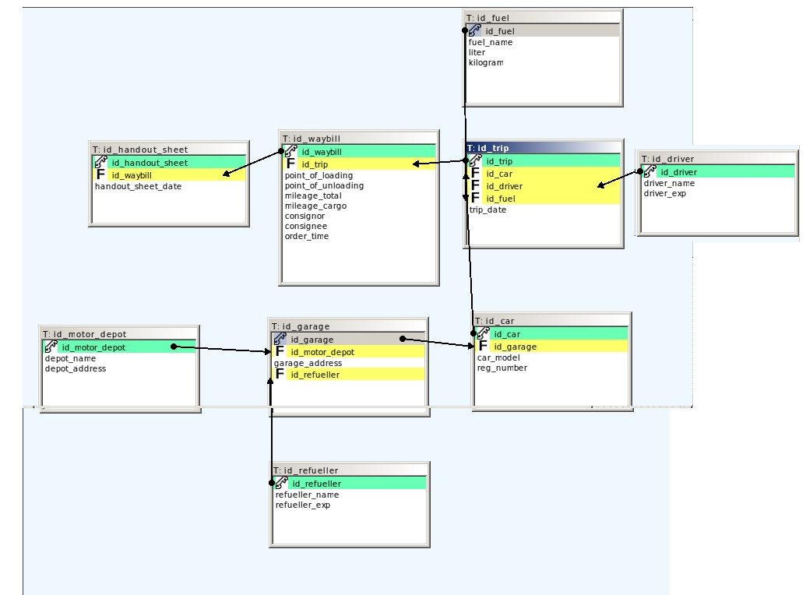

### Motor depot

База данных для сети автобаз

Предприятие имеет несколько автобаз. На каждой автобазе (код, название, адрес) ведется учет горюче-смазочных средств (ГСМ), заправляемых в автомобили, выполняющих рейсы по соответствующим путевым листам. В путевом листе отражается информация о рейсе:  пункты погрузки и разгрузки, пробег общий и с грузом, наименования грузоотправителя и грузополучателя, время в наряде (в днях и/или часах). При заправке автомобилей в гараже формируется раздаточная ведомость, в которой указаны: номер ведомости, дата. В одной ведомости могут быть оформлены данные на нескольких водителей. В каждой позиции ведомости записывается: марка автомобиля, государственный регистрационный номер автомобиля, номер путевого листа, фамилия, инициалы водителя, количество заправленного ГСМ, в литрах и килограммах. ГСМ – это бензин, дизтопливо, дизмасло, автол, солидол, нигрол и т.п. Для каждого автомобиля на одну поездку может быть выделено несколько видов ГСМ. Ведомость подписывает сотрудник, имеющий должность заправщика. Указываются его ФИО. В заголовке ведомости указывается автобаза, которой принадлежит автомобиль и гараж. У каждой автобазы может быть несколько гаражей, расположенных по различным адресам. Ведомости формируются отдельно для каждого гаража заправщиком гаража.

СУБД: PostgreSQL

Версия:. Picture below 13.2 
