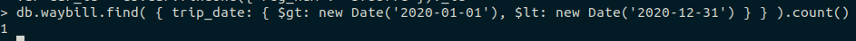

### Запросы

## Запрос 1
Количество поездок в определенном году
```
db.waybill.find( { trip_date: { $gt: new Date('2020-01-01'), $lt: new Date('2020-12-31') } } ).count()
```



## Запрос 2
Найти количество заправщиков, чей стаж больше 2 лет
```
db.refuellers.find({exp: {$gte: 2}})
```


## Запрос 3
Вывести общий путь и имя водителя, сортировать по возрастанию
```
db.waybill.find({}, {mileage_total: 1, driver: 1}).sort({mileage_total: 1})
```


## Запрос 4
Узнать дату, в которую водитель ездил на определенной машине
```
var driver_id = db.drivers.findOne({name: "Mike Vazovsky"})._id
var car_id = db.car.findOne({reg_num: "k972jui"})._id	
db.waybill.find({"driver.$id": driver_id, "car.$id": car_id}, {trip_date: 1})
```


## Запрос 5
Вывести те листы, где такой-то водитель проехал всего больше 100 км
```
var driver_id = db.drivers.findOne({name: "Mike Vazovsky"})._id
db.waybill.find({"driver.$id": driver_id, "mileage_total": {$gte: 100}}).pretty()
```


## Запрос 6
Узнать максимальный общий пробег, где либо время в пути от 5 часов, либо пробег с грузом больше 100 км
```
db.waybill.find({mileage_total: {$gte: 80}}).sort({mileage: -1}).limit(1).pretty()
```


## Запрос 7
Узнать средний пробег всех водителей
```
db.waybill.aggregate(
  [
    {
      $group: { _id: "$driver", avg: { $avg: "$mileage_total" } }
    }
  ]
)
```


## Запрос 8
Сгруппировать по количеству опыта всех водителей
```
db.drivers.mapReduce(
		function() {emit(this.exp, this.name);}, 
		function(key, values) {return values.join();}, 
		{out: {inline: 1}}
)
```

