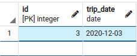
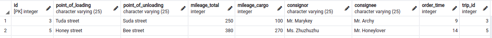
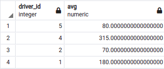
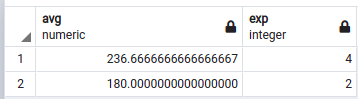
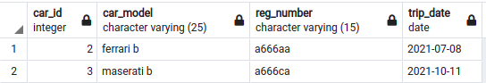
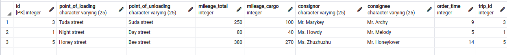
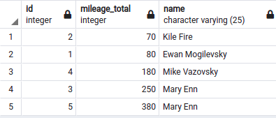

### Запросы

## Запрос 1
Узнать дату, в которую водитель ездил на определенной машине
```
select id, trip_date from trip where driver_id = 4 and car_id = 5; 
```



## Запрос 2
Узнать, сколько поездок в этом году
```
select count(*) from trip where extract(year from trip_date) = extract(year from now()); 
```


## Запрос 3
Вывести те путевые листы, где поездку выполнял четвертый водитель и пробег больше 200 км
```
select * from waybill where trip_id in (select id from trip where driver_id = 4) and mileage_total > 200;
```


## Запрос 4
Узнать максимальный общий пробег, где либо время в пути от 5 часов, либо пробег с грузом больше 100 км
```
select MAX(mileage_total) from waybill where order_time > 5 or mileage_cargo > 100;
```


## Запрос 5
Посчитать средний пробег у одного водителя
```
select AVG(mileage_cargo) from waybill where trip_id in (select id from trip where driver_id = 4);
```


## Запрос 6
Посчитать средний пробег у всех водителей
```
select driver_id, avg(mileage_total) from waybill inner join trip on waybill.trip_id = trip.id group by driver_id;
```


## Запрос 7
Вывести средний общий пробег водителей в зависимости от стажа, если средний пробег больше сотни
```
select avg(mileage_total), driver.exp from waybill inner join trip on waybill.trip_id = trip.id inner join driver on trip.driver_id = driver.id group by exp having avg(mileage_total) > 100;
```


## Запрос 8
Вывести имена заказчиков с маленькой буквы
```
select id, point_of_loading, lower(consignee) from waybill;
```


## Запрос 9
Вывести только фамилии заказчиков (без приставки мистер)
```
select id, point_of_loading, replace(lower(consignee), 'mr.', '') from waybill;
```


## Запрос 10
Найти людей, которые работают и водителями, и заправщиками
```
select name from driver intersect select name from refueller;
```


## Запрос 11
Вывести всех сотрудников компании на автобазах (группировать по имени, чтобы не было дупликатов, если кто-то работает на двоих должностях)
```
select name from driver union select name from refueller group by name;
```


## Запрос 12
Вывести информацию по машинам, которые были в поездках в этом году
```
select trip.car_id, car_model, reg_number, trip_date from trip inner join car on trip.car_id = car.id where extract(year from trip_date) = extract(year from now());
```


## Запрос 13
Вывести путевые листы тех водителей, чей стаж больше 3 лет
```
select * from waybill where trip_id in (select id from trip where driver_id in (select id from driver where exp > 3));
```


## Запрос 14
Найти количество заправщиков, чей стаж больше 2 лет
```
select count(*) from refueller where exp > 2;
```


## Запрос 15
Вывести водителя и его стаж, если он же занимает должность заправщика
```
select name, exp from driver where exists (select 1 from refueller where refueller.name = driver.name)
```


## Запрос 16
Вывести заправщика и его стаж, если он же занимает должность водителя
```
select name, exp from refueller where name = any (select name from driver);
```


## Запрос 17
Вывести id путевого листа, общий путь и имя водителя, сортировать всё по пути
```
select waybill.id, mileage_total, driver.name from waybill inner join trip on waybill.trip_id = trip.id inner join driver on trip.driver_id = driver.id order by mileage_total;
```



