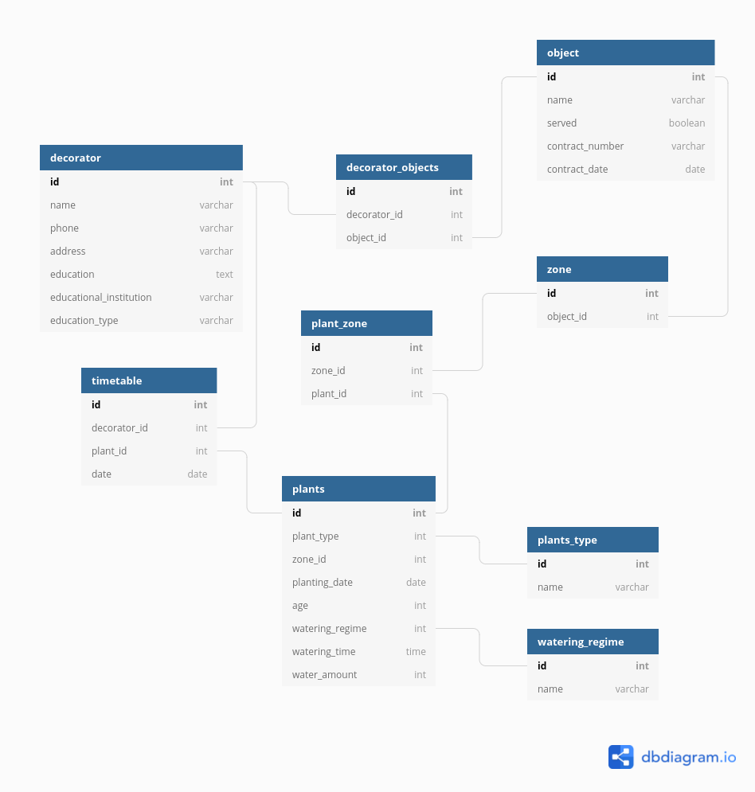

### Park improvement system

База данных для благоустройства парков

Предприятие оказывает такие виды услуг, как: формирование ландшафтов, насаждение парков, озеленение улиц и скверов. Фирма имеет название, юридический адрес, код по ЕГРЮЛ. 
Объект может обслуживаться предприятием или нет. Для обслуживаемого объекта необходимо знать реквизиты договора предприятия со сторонней организацией.
У объекта может быть несколько декораторов. О декораторах парка необходимо хранить информацию о ФИО, телефоне, адресе, образовании, названии законченного учебного заведения, категории (высшая, первая, без категории).
Каждый обслуживаемый объект делится на зоны. Каждому высаживаемому растению присваивается уникальный номер в пределах зоны. Необходимо хранить дату высадки растения и возраст растения. Растение может быть высажено в многолетнем возрасте. Каждое растение относится к какому-либо одному виду и жизненной форме (дерево, кустарник, лиана и т.д.), характеризуется временем возможной высадки и в грунт, временем цветения, особыми характеристиками. Режим полива каждого растения зависит от возраста растения и его вида. Каждый полив характеризуется днем (каждый день, один раз в неделю и т.п.), временем полива, нормой воды в литрах в зависимости от сезона. Насаждения поливаются максимум один раз в день. 
Необходимо иметь информацию о сотрудниках, обслуживающих объект, которые ухаживают за насаждениями (ФИО, телефон, адрес). Каждый служитель закрепляется за насаждением по рабочему графику (дата). На каждую дату закреплен за насаждением только один сотрудник. 

СУБД: PostgreSQL

Версия:. 13.2 
