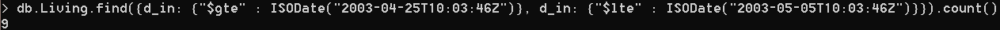
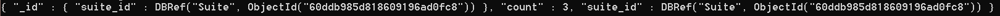
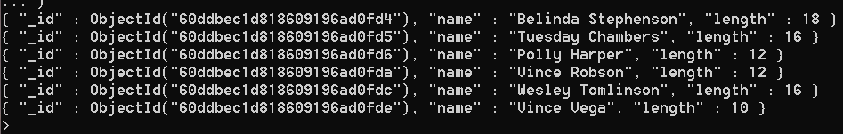
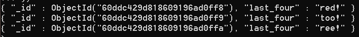
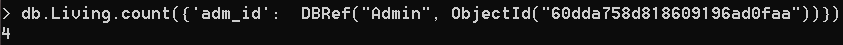

# Queries

##### Запрос 1:  Вывести количество человек, заселившихся между 25 апреля и 5 мая 2003.

```sql
 db.Living.find({
                d_in: {"$gte" : ISODate("2003-04-25T10:03:46Z")},
                d_in: {"$lte" : ISODate("2003-05-05T10:03:46Z")}
                }).count()
```

##### Результат запроса 1:



##### Запрос 2:  Вывести номера, где проживали более одного раза

```sql
db.Living.aggregate([{
      '$group': {
        '_id': {'suite_id': '$suite_id'}, 
        'count': {'$sum': 1}, 
        'suite_id': {'$last': '$suite_id'}}
    }, {
      '$match': {
        'count': {'$gt': 1}
    }}])
```

##### Результат запроса:



##### Запрос 3: Вывести всех клиентов, количество символов в имени у которых чётное

```sql
db.Client.aggregate([{
      $project: {
        "name": 1,
        "length": { $strLenCP: "$name" }
      }
    }, {
      '$match': {
        'length': {'$mod': [ 2, 0 ] }
    }}])
```

##### Результат запроса:



##### Запрос 4: Вывести последние четыре символа из текста договора

```sql
db.Contract.aggregate({
    $project: {
        "last_four": { $substr: [ "$text", { $subtract: [ { $strLenCP: "$text" }, 4 ] }, 4 ] }
    }
})
```

##### Результат запроса:



##### Запрос 5: Посдсчитать, сколько записей в таблице «Living» утверждено вторым администратором

```sql
db.Living.count({
                 'adm_id':  DBRef("Admin", 
                                  ObjectId("60dda758d818609196ad0faa"))
                 })
```

##### Результат запроса 5:

