# Удалённое управление БД

##### На главной странице:

- навигационное меню;
- текстовое описание;
- схема базы данных;
- выбор таблицы.

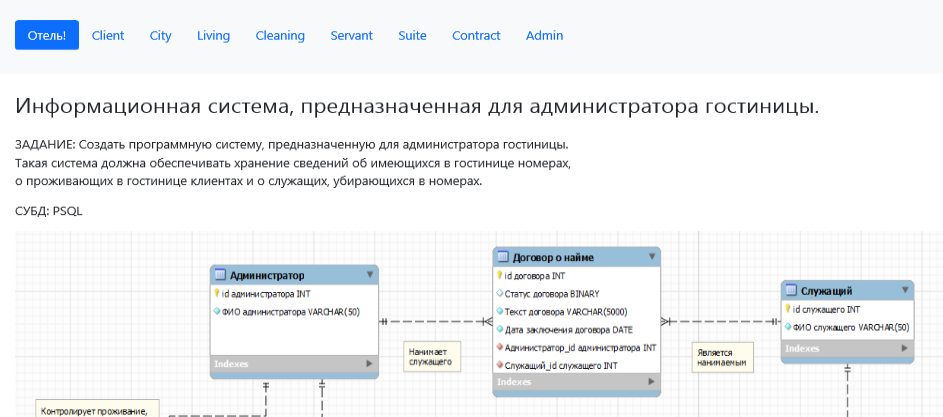 

##### На подстранице происходит выбор действия

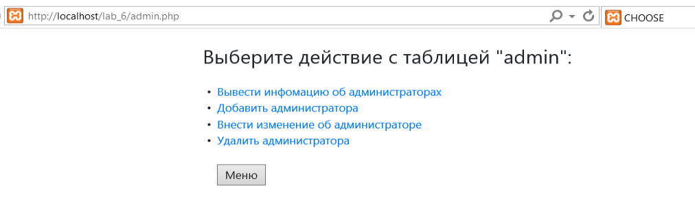

###### Выбор данных из таблицы:

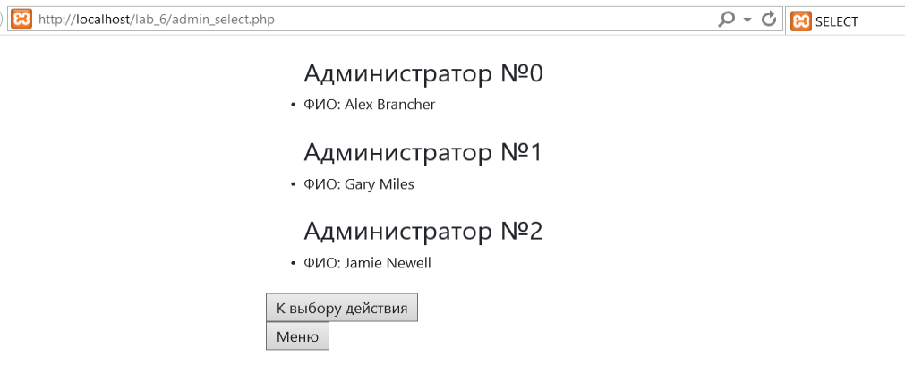

###### Добавление нового администратора:

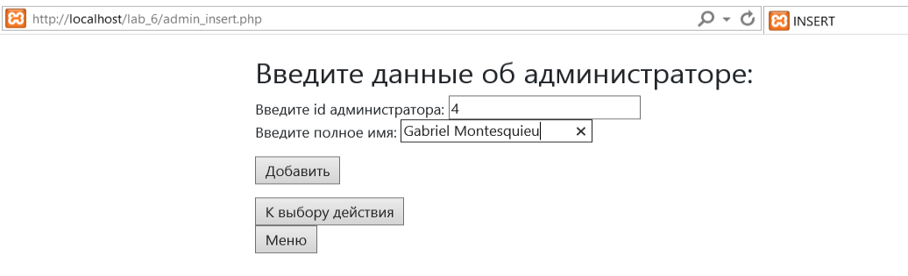

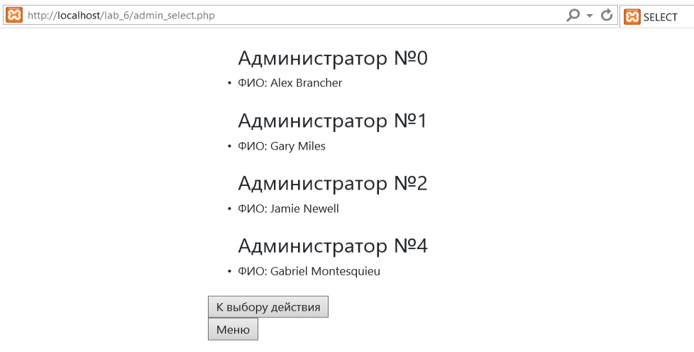

###### Внесение изменений:

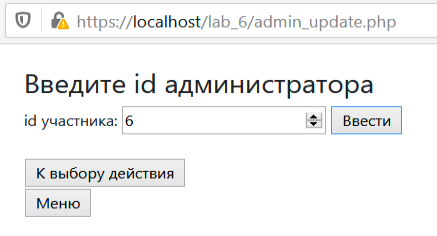

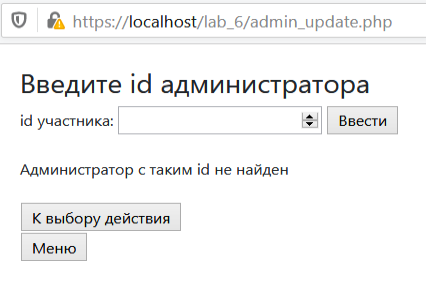

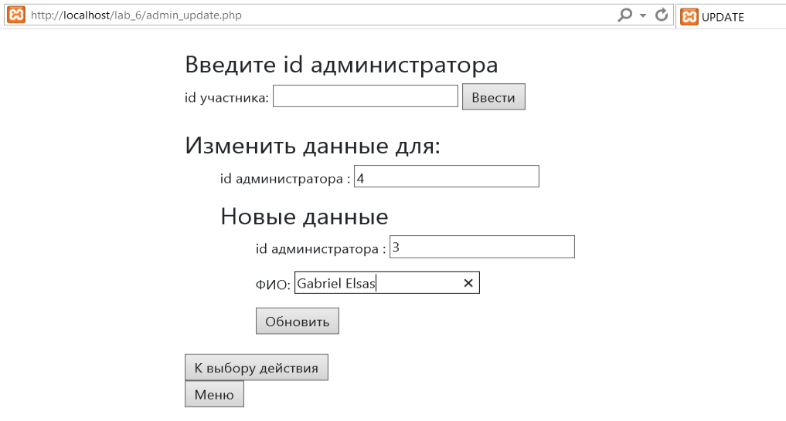

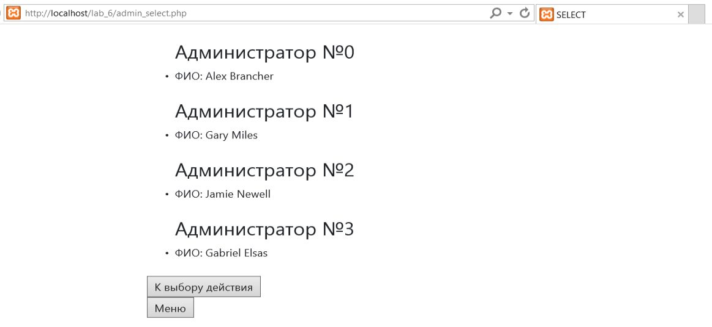

###### Удаление администратора:

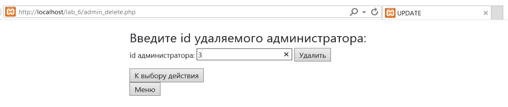

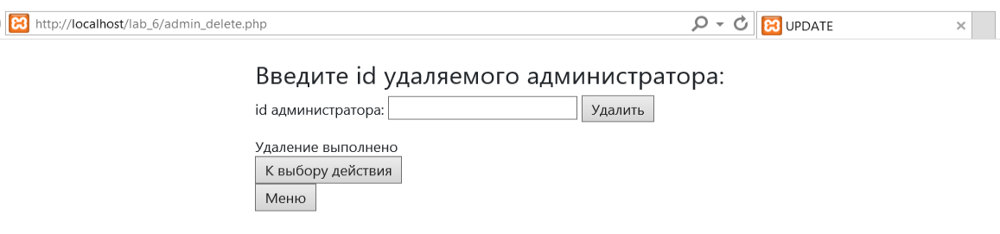

##### Возможен также возврат к CRUD-действиям и начальной странице.