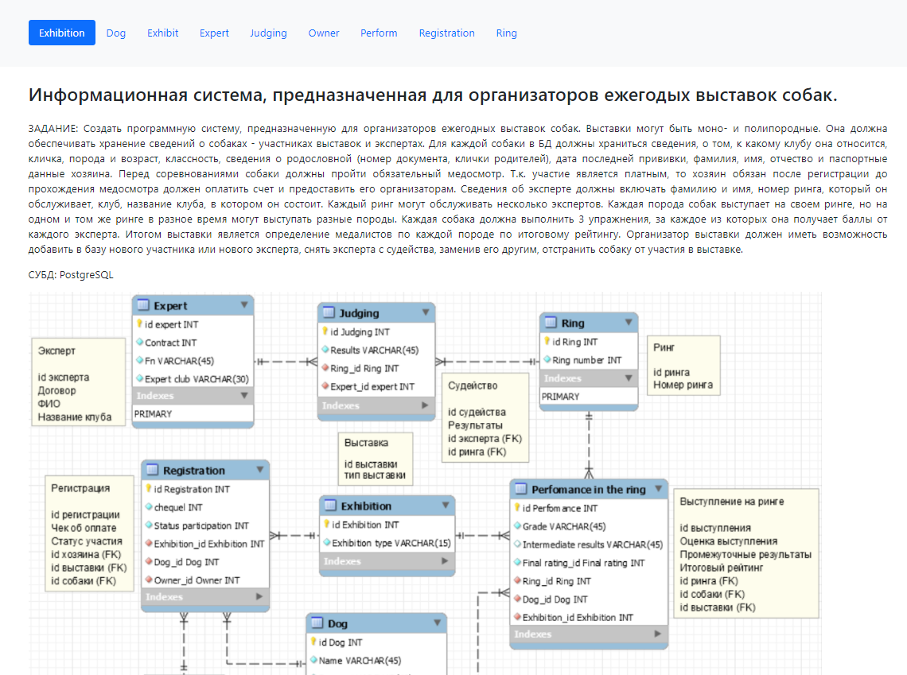
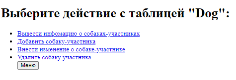
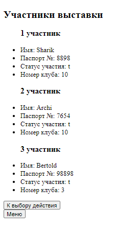
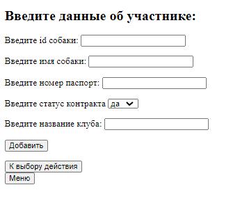
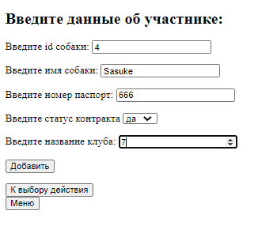
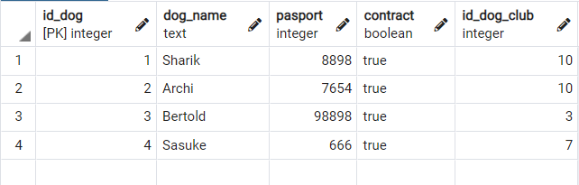
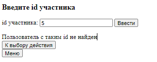
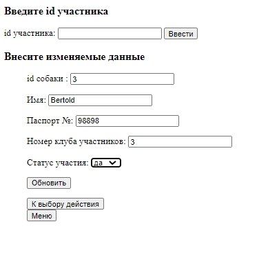
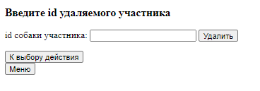

## Сайт для работы с базой данных 

##### На главной странице сайта, оформленной с помощью фреймворка "Bootstrap 5", реализовано как навигационное меню, помогающее пользователю ориентироваться на странице, так и текстовое описание и схема базы данных.

##### На навигационной панели предоставлен выбор таблицы с возможностью перехода на страницу, где можно осуществить нужные действия с таблицей. Для примера возьмем таблицу "Dog".

##### При нажатии на "Вывести информацию о собаках-участниках" мы получаем  информацию из таблицы "Dog", которая хранится в бд. 

##### При нажатии на "Добавить собаку-участника" мы получаем возможность ввести нужные данные о новом участнике, которые автоматически добавляются в саму базу данных.

##### Результат добавление:

##### При нажатии на "Внести изменения о собаке" мы сначала вводим id участника, для проверки на существование данного id в базе данных. Далее мы либо получаем сообщение об ошибке, либо информацию о уже имеющихся данных с возможностью изменения.

##### При нажатии на "Удалить собаку-участника" мы по id удаляем участника и информацию о нем из базы данных.

##### С каждой страницы мы можем вернуться как к "Выбору действия", так и в "Меню".