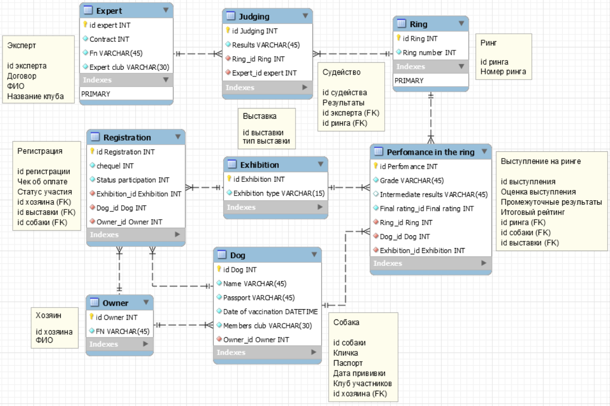

## Информационная система, предназначенная для организаторов ежегодых выставок собак.

Создать программную систему, предназначенную для организаторов ежегодных выставок собак. Выставки могут быть моно- и полипородные. Она должна обеспечивать хранение сведений о собаках - участниках выставок и экспертах. 

Для каждой собаки в БД должны храниться сведения, о том, к какому клубу она относится, кличка, порода и возраст, классность, сведения о родословной (номер документа, клички родителей), дата последней прививки, фамилия, имя, отчество и паспортные данные хозяина. Перед соревнованиями собаки должны пройти обязательный медосмотр.

Т.к. участие является платным, то хозяин обязан после регистрации до прохождения медосмотра должен оплатить счет и предоставить его организаторам.

Сведения об эксперте должны включать фамилию и имя, номер ринга, который он обслуживает, клуб, название клуба, в котором он состоит. Каждый ринг могут обслуживать несколько экспертов. Каждая порода собак выступает на своем ринге, но на одном и том же ринге в разное время могут выступать разные породы.

Каждая собака должна выполнить 3 упражнения, за каждое из которых она получает баллы от каждого эксперта. Итогом выставки является определение медалистов по каждой породе по итоговому рейтингу.

Организатор выставки должен иметь возможность добавить в базу нового участника или нового эксперта, снять эксперта с судейства, заменив его другим, отстранить собаку от участия в выставке.

