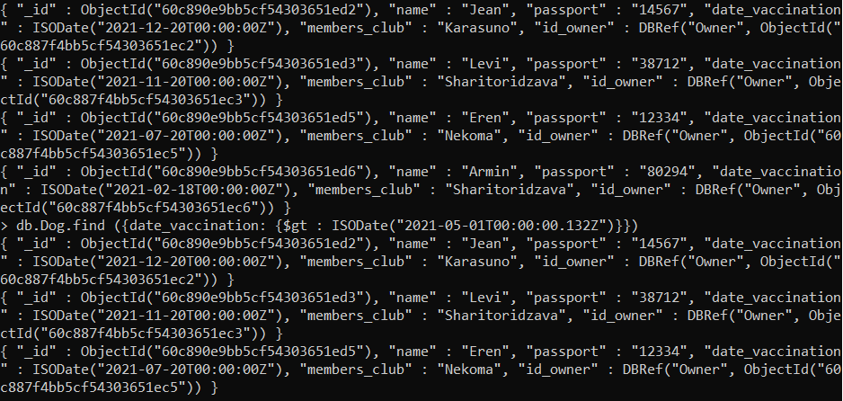
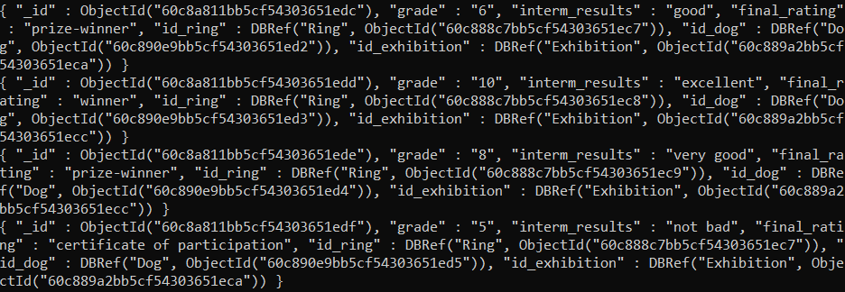
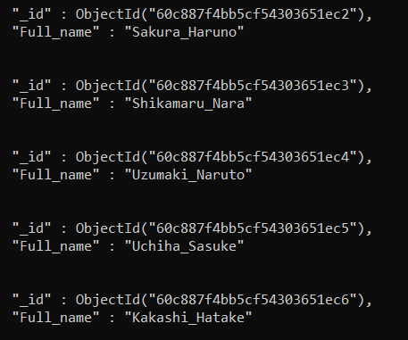
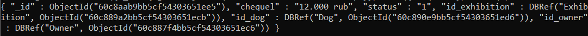
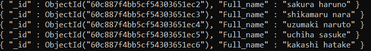

## Inquiries

##### Запрос 1:  Вывести  информацию о собаках, которые вакцинировались после 1 мая 2021 года.

```sql
db.Dog.find ({date_vaccination: {$gt : ISODate("2021-05-01T00:00:00.132Z")}})
```

##### Результат запроса 1:



##### Запрос 2: Вывести  информацию о выступлениях с промежуточными результатами.

```sql
db.Perform.find({interm_results: {$exists: true}})
```

##### Результат запроса 2:



##### Запрос 3: Вывести всех владельцев, заменив все пробелы в ФИО на "_".

```sql
db.Owner.aggregate([{$project:{Full_name:{$replaceAll:{input:"$Full_name", find:" ",replacement:"_"}}}}]).pretty()
```

##### Результат запроса 3:



##### Запрос 4: Вывести информацию о регистрации с максимальным чеком.

```sql
db.Registration.find({"_id":{$gt: ObjectId("60c8aab9bb5cf54303651ee3") }}).sort({chequel:1}).limit(1)
```

##### Результат запроса 4:



##### Запрос 5: Вывести  имена владельцев с нижним регистром.

```sql
db.Owner.aggregate([{$project: {Full_name: {$toLower: "$Full_name"}}}])
```

##### Результат запроса 5:



