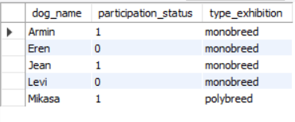
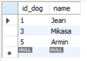

## Inquiries

##### Запрос 1.1:  Вывести  информацию о собаке на каком ринге она выступала, отсортированную по результатам выступления.

```sql
SELECT dog.name as dog_name, `perfomance in the ring`.grade, `perfomance in the ring`.final_rating, ring.ring_number
FROM dog, ring, `perfomance in the ring` 
WHERE (dog.id_dog = `perfomance in the ring`.id_dog) and (ring.id_Ring = `perfomance in the ring`.id_ring)
ORDER by `perfomance in the ring`.grade DESC;
```

##### Результат запроса 1.1:


##### Запрос 1.2: Вывести  информацию о статусе участия собаки и о типе выставки, отсортированную по именам собак.

```sql
SELECT dog.name as dog_name, registration.status as participation_status, exhibition.type as type_exhibition
FROM dog, exhibition, registration 
WHERE (dog.id_dog = registration.id_dog) and (exhibition.id_exhibition = registration.id_exhibition)
ORDER by dog.name;
```

##### Результат запроса 1.2:



##### Запрос 2: Вывести имя собак, у которых чек оплачен на сумму больше 5 000 и статус участия 1.

```sql
SELECT registration.id_dog, dog.name, registration.chequel
FROM registration JOIN dog ON registration.id_dog = dog.id_dog
WHERE (chequel > 5000) AND (status = 1);
```

##### Результат запроса 2:


##### Запрос 3: Вывести месяц и год даты последней вакцинации, которая была проведена после 2019 года.

```sql
SELECT id_dog, name, EXTRACT(MONTH from date_vaccination) AS month_vaccination, EXTRACT(YEAR from date_vaccination) AS year_vaccination
FROM dog WHERE EXTRACT(YEAR from date_vaccination) > 2019
ORDER BY month_vaccination DESC;
```

##### Результат запроса 3:


##### Запрос 4.1: Вывести всех собак и их клубы с использованием функции смены регистра.

```sql
SELECT id_dog, UPPER(name), UPPER(members_club) FROM dog;
```

##### Результат запроса 4.1:


##### Запрос 4.2:  Вывести первые пять символов от наименования финального результата, отсортированных по оценке выступления в порядке возрастания.

```sql
SELECT id_perfomance, LEFT(final_rating, 5) AS final_rating, grade 
FROM `perfomance in the ring` ORDER BY grade;  
```

##### Результат запроса 4.2:


##### Запрос 6: Вывести количество собак, у которых вакцинация была пройдена в период от 1 января 2019 года до 31 декабря 2021 года.

```sql
SELECT COUNT(id_dog) AS kolvo_dog 
FROM dog WHERE date_vaccination 
BETWEEN '2019-01-01' and '2021-12-31';
```

##### Результат запроса 6:


##### Запрос 7: Вывести название тех клубов экспертов, в которых количество участников больше 1.

```sql
SELECT expert_club FROM expert 
GROUP BY expert_club HAVING COUNT(expert_club) > 1;
```

##### Результат запроса 7:


##### Запрос 8: Вывести уникальные номера и имена собак, статус участия которых равен 1.

```sql
SELECT id_dog, name FROM dog 
WHERE id_dog = ANY (SELECT id_dog FROM registration WHERE status = 1);
```

##### Результат запроса 8:



##### Запрос 10.1: Вывести информацию о хозяине собаки, которая не прошла регистрацию.

```sql
SELECT registration.id_registration, owner.id_owner, owner.FN as name_owner
FROM registration 
INNER JOIN owner ON registration.id_owner = owner.id_owner 
WHERE (status = 0);
```

##### Результат запроса 10.1:


##### Запрос 10.2: Вывести информацию о собаке, чьи баллы за выступление больше "5" и выставка типа "полипородная".

```sql
SELECT `perfomance in the ring`.id_perfomance, dog.name, `perfomance in the ring`.grade, exhibition.id_exhibition
FROM `perfomance in the ring`
JOIN dog ON `perfomance in the ring`.id_dog = dog.id_dog
INNER JOIN exhibition ON `perfomance in the ring`.id_exhibition = exhibition.id_exhibition
WHERE (grade > 5 and type = 'polybreed');
```

